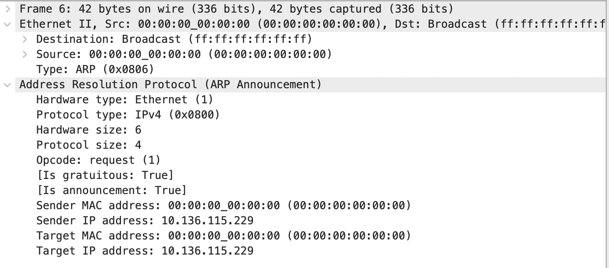
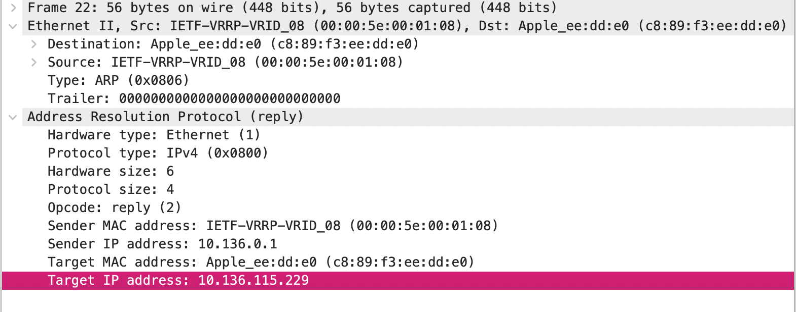
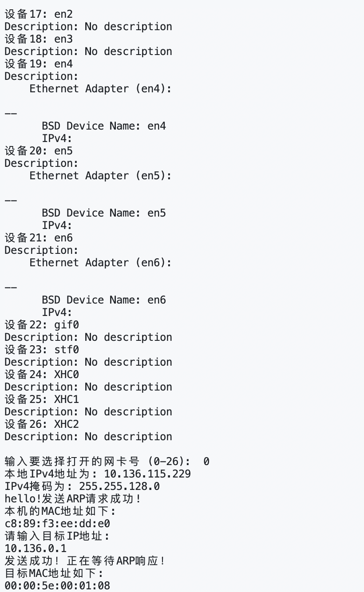
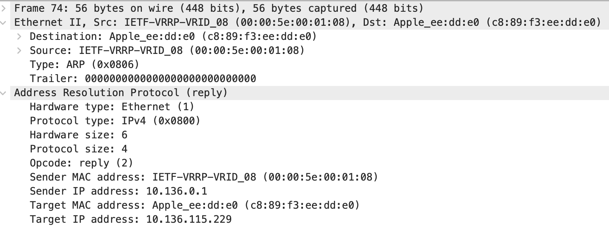

<h2><center>第三次实验报告：编程获取IP地址与MAC地址的对应关系</center></h2>

<h5><center>2112614 刘心源</center></h5>

### 一、实验内容

通过编程获取IP地址与MAC地址的对应关系实验，要求如下：

1. 在IP数据报捕获与分析编程实验的基础上，学习NPcap(Libpcap)的数据包发送方法。
2. 通过Npcap(Libpcap)编程，获取IP地址与MAC地址的映射关系。
3. 程序要具有输入IP地址，显示输入IP地址与获取的MAC地址对应关系界面。界面可以是命令行界面，也可以是图形界面，但应以简单明了的方式在屏幕上显示。
4. 编写的程序应结构清晰，具有较好的可读性。


### 二、实验原理

#### Libpcap

Libpcap是一个跨平台的数据包捕获库；支持多个操作系统，包括macOS、Linux，BSD等；在Windows上的版本为`WinPcap`。

- **跨平台支持**：Libpcap 提供了一个在多种Unix-like操作系统上进行原始数据包捕获的功能强大的用户级库。它在 Linux、macOS 以及其他多种 Unix 类型的系统上都可以运行，而不仅仅是限于某个特定的平台或架构，为开发者提供了广泛的开发和部署选择。
- **高效的数据包过滤**：Libpcap 拥有一个高效的数据包过滤系统，它能够在内核级别对数据包进行过滤，极大地减小了需要在用户空间处理的数据包的数量。开发者可以使用 BPF（Berkeley Packet Filter）语法定义数据包过滤规则，以便只捕获对分析和处理特定问题相关的数据包。
- **数据包捕获机制**：Libpcap 提供了多种数据包捕获的机制，例如 `pcap_loop()` 和 `pcap_dispatch()`，它们分别提供了基于数据包数量和超时的数据包捕获。此外，还有 `pcap_next()` 和 `pcap_next_ex()` 函数，这些函数提供了更简单的基于单个数据包的捕获方法。
- **易于使用的 API**：Libpcap 提供了一套简单且功能强大的 API，开发者可以使用这些 API 快速地构建自己的网络监控或分析工具。Libpcap API 允许开发者执行如打开网络接口、编译和应用过滤器、捕获数据包等基本操作。
- **底层数据包处理**：Libpcap 处理了与底层网络硬件和操作系统交互所需的所有细节，如读取数据包、处理数据包等，使开发者能够专注于处理捕获的数据包，而无需担心底层的具体实现细节。
- **开源与社区支持**：Libpcap 是开源的，并且有一个活跃的开发和用户社区。因此，它能够支持最新的网络技术和协议，也能够在遇到问题时得到社区的帮助和支持。
- **扩展性和兼容性**：Libpcap 支持通过各种语言的绑定和包装器在多种编程语言中使用，如 Python、Perl、Ruby 等。这为在多种场景和平台下开发网络工具提供了极大的便利和灵活性。同时，由于 Libpcap 的广泛使用，它在网络工具开发领域形成了一种事实上的标准，许多工具和库为其提供了支持或集成。


#### ARP地址解析协议

ARP (Address Resolution Protocol) 是一种用于将IP地址映射到物理地址（例如MAC地址）的协议。ARP请求被用来查询网络中特定IP地址对应的MAC地址。ARP报文有多个字段组成，以下是一个典型ARP报文头的结构：

1. **硬件类型（Hardware Type）**:
   - 说明了使用的硬件类型。例如，以太网的硬件类型是1。
2. **协议类型（Protocol Type）**:
   - 表示要映射的协议地址。例如，IPv4的协议类型是0x0800。
3. **硬件地址长度（Hardware Address Length）**:
   - 描述硬件地址的长度。对于以太网MAC地址，长度是6。
4. **协议地址长度（Protocol Address Length）**:
   - 描述协议地址的长度。对于IPv4地址，长度是4。
5. **操作（Opcode）**:
   - 定义这是ARP请求还是ARP响应。1代表请求，2代表响应。
6. **发送方硬件地址（Sender Hardware Address）**:
   - 发送ARP报文的设备的硬件地址。
7. **发送方协议地址（Sender Protocol Address）**:
   - 发送ARP报文的设备的协议地址，例如IP地址。
8. **目标硬件地址（Target Hardware Address）**:
   - ARP报文的目标设备的硬件地址。对于ARP请求，此字段通常为零。
9. **目标协议地址（Target Protocol Address）**:
   - ARP报文的目标设备的协议地址，例如IP地址。


### 三、实验过程

#### 设计思路

- 初始化和设备选择
  - 首先获取和列出所有网络接口（网卡）
  - 用户可以根据列出的网卡列表，选择一个用于发送和接收ARP报文的网卡。
- 设置与过滤
  - 打开选定的网卡，并准备捕获通过该网卡传输的数据包，获取其IP
  - 设定过滤器，仅捕获ARP包，忽略其他类型的网络数据包。
- 发送ARP请求
  - 组装一个ARP请求数据包。这个请求通常是询问一个特定IP地址对应的MAC地址。
  - 将ARP请求发送到网络。
- 接收ARP响应
  - 捕获通过选定网络接口接收的ARP响应数据包。
  - 解析接收到的ARP响应，提取发送者的IP和MAC地址信息。


#### 实现代码

1. ARP包数据结构设计

   ```c++
   //arp_resolver.cpp
   #pragma pack(1)
   struct ARP_HEADER {
       u_short HardwareType; // 硬件类型
       u_short ProtocolType; // 协议类型
       u_char HardwareSize; // 硬件地址长度
       u_char ProtocolSize; // 协议地址长度
       u_short Operation; // 操作类型
       u_char SenderHardwareAddress[6]; // 发送方MAC地址
       u_char SenderProtocolAddress[4]; // 发送方IP地址
       u_char TargetHardwareAddress[6]; // 目的MAC地址
       u_char TargetProtocolAddress[4]; // 目标IP地址
   };
   #pragma pack()   //恢复缺省对齐方式
   
   //ethernet.h
   typedef struct  ether_header {
   	u_char  ether_dhost[ETHER_ADDR_LEN]; //目的MAC
   	u_char  ether_shost[ETHER_ADDR_LEN]; //源MAC
   	u_short ether_type; //类型
   } ether_header_t;
   ```

2. 获取网卡列表，并打印相关信息

   ```cpp
       if (pcap_findalldevs(&alldevs, errbuf) == -1){
           printf("Error in pcap_findalldevs_ex: %s\n", errbuf);
           return 1;
       }
   	int i = 0;
   	for (dev = alldevs; dev; dev = dev->next,++i){
   		printf("设备%d: %s\n", i, dev->name);
           std::string command = "system_profiler SPNetworkDataType | grep -A1 " + std::string(dev->name);
           std::string output = exec(command.c_str());
           if(output.length() == 0) std::cout << "Description: " << "No description" << std::endl;
           else std::cout << "Description: " << std::endl << output;
   	}
   
   	if (i == 0)
   	{
   		printf("\n没有发现网络接口,请检查设备\n");
   		return 0;
   	}
   ```

   由于MacOS的限制，无法直接通过`d->description`直接获取设备信息。此处我在遍历网络设备时，对于每个设备，构建一个调用`system_profiler`并筛选特定设备名的命令。这个命令的输出可能包含设备的描述信息。为了能够在代码中直接传入命令，我定义了一个`exec`函数：

   ```cpp
   std::string exec(const char* cmd) {
       std::array<char, 128> buffer;
       std::string result;
       std::unique_ptr<FILE, decltype(&pclose)> pipe(popen(cmd, "r"), pclose);
       if (!pipe) {
           throw std::runtime_error("popen() failed!");
       }
       while (fgets(buffer.data(), buffer.size(), pipe.get()) != nullptr) {
           result += buffer.data();
       }
       return result;
   }
   ```

   

   也可以使用`System Configuration framework`或者`Core Foundation framework`中的API来获取网络接口的信息，这些都是苹果提供的原生API集。PS:

   ```objective-c
   // File name: main.mm
   #include <SystemConfiguration/SystemConfiguration.h>
   #include <iostream>
   
   int main() {
       // Create an array to hold network interfaces
       CFArrayRef interfaceArray = SCNetworkInterfaceCopyAll();
       // Get the number of network interfaces
       CFIndex numberOfInterfaces = CFArrayGetCount(interfaceArray);
       // Iterate over each network interface
       for (CFIndex i = 0; i < numberOfInterfaces; i++) {
           // Get a reference to a network interface
           SCNetworkInterfaceRef interface = (SCNetworkInterfaceRef)CFArrayGetValueAtIndex(interfaceArray, i);
           // Get the localized name of the network interface
           CFStringRef name = SCNetworkInterfaceGetLocalizedDisplayName(interface);
           // Convert the name to a C string and print it
           CFIndex nameLength = CFStringGetLength(name) + 1;
           char* nameCString = (char*)malloc(nameLength);
           CFStringGetCString(name, nameCString, nameLength, kCFStringEncodingUTF8);
           std::cout << "Interface " << i << ": " << nameCString << std::endl;
           free(nameCString);
       }
       // Release the array when done
       CFRelease(interfaceArray);
       return 0;
   }
   ```

3. 选取网卡并打印其信息

   在上面的命令行中就可以看到IP地址了，但是我通过设备地址`d->addr`也可以获取。

   ```cpp
   	printf("\n输入要选择打开的网卡号 (0-%d):\t", i-1);
       int devIndex;
   	scanf("%d",&devIndex);
   	if (devIndex < 0 || devIndex >= i) {
   		printf("\n网卡号超出范围\n");
   		pcap_freealldevs(alldevs); //释放设备列表
   		return 0;
   	}
       for (dev = alldevs, i = 0; i < devIndex; dev = dev->next, ++i) ;
   
   	// 获取本地IP和掩码
   	char ipString[INET_ADDRSTRLEN]; // 用于存储IP地址字符串
       char maskString[INET_ADDRSTRLEN]; // 用于存储掩码地址字符串
       const char *ipSrc; // 指向转换后的IP字符串
       const char *maskSrc; // 指向转换后的掩码字符串
       pcap_addr_t *d;
   	for(d = dev->addresses;d!=NULL;d=d->next){
   		if (d->addr->sa_family == AF_INET){
   			if (d->addr) {
   				ipSrc = inet_ntop(AF_INET, &((struct sockaddr_in*)d->addr)->sin_addr, ipString, sizeof(ipString));
   				printf("本地IPv4地址为: %s\n", ipSrc);
   			}
   			if (d->netmask) {
   				maskSrc = inet_ntop(AF_INET, &((struct sockaddr_in*)d->netmask)->sin_addr, maskString, sizeof(maskString));
   				printf("IPv4掩码为: %s\n", maskSrc);
   				printf("hello!");
   			}
   			break;
       	}
   	}
   ```

4. 根据选择打开对应的网卡

   ```cpp
     pcap_t *adhandle= pcap_open_live(dev->name, 65536, 1, 2000, errbuf);
   	if (adhandle == NULL) {
   		printf("\n无法打开适配器!请检查设备\n");
   		pcap_freealldevs(alldevs);
   		return 0;
   	}
   ```

5. 构造ARP包，广播获取本机的MAC地址

   前面可以获取本机的IP地址，但是由于MacOS上MAC地址也需要使用Objective-c++进行获取，因此我选择采用另一种方式：自行构造一个ARP包广播，通过返回的ARP包来获取本机的MAC地址。

   ```cpp
   	//发送ARP包来获取本机MAC地址
   	u_char myMAC[6];
   	uint8_t sendbuf[42]; //包体缓冲区
   	ether_header eth;
   	ARP_HEADER arp;
   	pcap_pkthdr *pkth; //包体结构体
   	const uint8_t* pktdata; //包体数据包
   	memset(eth.ether_dhost,(uint8_t)0xff,6); //目的MAC，为ff:ff:ff:ff:ff:ff,广播
   	memset(eth.ether_shost,0x00,6); //源MAC随便写
   	eth.ether_type=htons(0x0806); //表示eth上层协议为ARP
   
   	arp.HardwareType=htons(1); //链路层为以太网
   	arp.ProtocolType=htons(0x0800); //ARP上层协议为IP
   	arp.HardwareSize = 6; //48位MAC
   	arp.ProtocolSize = 4; //32位IP
   	arp.Operation = htons(1); //此包为ARP请求
   
   	memset(arp.SenderHardwareAddress,0x00,6); //源MAC，和上面一样
   	memset(arp.TargetHardwareAddress,(uint8_t)0x00,6); //目的MAC地址，随便写的
   	inet_pton(AF_INET, ipSrc, &arp.SenderProtocolAddress); //源IP，使用本机IP
   	inet_pton(AF_INET, ipSrc, &arp.TargetProtocolAddress); //目的IP，使用本机IP
   
   	memset(sendbuf,0,sizeof(sendbuf));
   	memcpy(sendbuf,&eth,sizeof(eth));
   	memcpy(sendbuf+sizeof(eth),&arp,sizeof(arp));
   
   	if(pcap_sendpacket(adhandle,sendbuf,42)!=0){
   		printf("发送ARP请求失败!\n");
   		return 0;
   	}
   	printf("发送ARP请求成功!\n");
   
   	while (1)
   	{
   		int result = pcap_next_ex(adhandle, &pkth, &pktdata);
   		if(result < 0 ){
   			printf("捕获数据包发生错误\n");
   			return 0;
   		}
   		else if(result == 0){
   			printf("没有捕获到数据包\n");
   			break;
   		}
   		else{
   			unsigned char *temp=NULL;
   			ether_header *neweth = (ether_header*)(pktdata);
   			ARP_HEADER *newarp = (ARP_HEADER *)(pktdata+sizeof(ether_header));
   			if(ntohs(neweth->ether_type) == 0x0806 && ntohs(newarp->Operation) == 0x0002 && memcmp(newarp->TargetProtocolAddress,arp.SenderProtocolAddress,4) == 0){ //检查是否是我们需要的ARP包
   				printf("本机的MAC地址如下:\n");
   				for(int i=0;i<6;i++){
   					myMAC[i] = newarp->TargetHardwareAddress[i];
   					printf("%02x",myMAC[i]);
   					if(i<5) printf(":");
   				}
   				printf("\n");
   				break;
   			}
   		}
   	}
   ```

   在自行构造的ARP包中有一些地址是不知道的，先随便写一个，不会影响我们发的报文。使用wireshark捕获我们的ARP包，结果如下：

   

   发现数据都和我们写的一样，说明我们写的是正确的。

6. 输入目的IP地址，构造ARP包获取目的IP的MAC地址

   首先写了一个send函数，与上面构造ARP包获取本机MAC地址的代码很相似，将我们已有的MAC地址和IP地址填进去就可以了。

   ```cpp
   void send_arp_request(pcap_t *adhandle,in_addr local_ip,u_char *local_mac,in_addr target_ip){
   	u_char packet[sizeof(ether_header) + sizeof(ARP_HEADER)];
   	ether_header *eth = (ether_header *)packet;
      ARP_HEADER *arp = (ARP_HEADER *)(packet + sizeof(ether_header));
   	//填充以太网帧的头部
   	for(int i=0;i<6;i++){
   		eth->ether_dhost[i] = 0xff;
   		eth->ether_shost[i] = local_mac[i];
   	}
   	eth->ether_type = htons(0x0806);
   	//arp头
   	arp->HardwareType = htons(1); // 1代表链路层为Ethernet
   	arp->ProtocolType = htons(0x0800);	// ARP上层协议为IP 
   	arp->HardwareSize = 6; //48位MAC
   	arp->ProtocolSize = 4; //32为IP
   	arp->Operation = htons(0x0001); //1代表此包为ARP请求
   	for(int i=0;i<6;i++){
   		arp->SenderHardwareAddress[i] = local_mac[i];
   		arp->TargetHardwareAddress[i] = 0x00;
   	}
   	memcpy(arp->SenderProtocolAddress,&local_ip.s_addr,4);
   	memcpy(arp->TargetProtocolAddress,&target_ip.s_addr,4);
   	int result = pcap_sendpacket(adhandle,packet,sizeof(packet));
   	if(result == -1){
   		printf("发送失败!\n");
   	}
   	else if(result == 0){
   		printf("发送成功！正在等待ARP响应！\n");
   	}
   }
   ```

   然后使用receive函数获取ARP响应

   ```cpp
   bool receive_arp_response(pcap_t *adhandle, in_addr target_ip, u_char *target_mac){
   	struct pcap_pkthdr *header;
   	const u_char *packet;
   	while(pcap_next_ex(adhandle,&header,&packet) >= 0){
   		ether_header *eth = (ether_header *)packet;
   		if(ntohs(eth->ether_type) !=0x0806) continue;
   		ARP_HEADER *arp = (ARP_HEADER *)(packet+sizeof(ether_header));
   		if(ntohs(arp->Operation) == 0x0002 && memcmp(arp->SenderProtocolAddress,&target_ip.s_addr,4) == 0){
   			memcpy(target_mac,arp->SenderHardwareAddress,6);
   			return true;
   		}
   	}
   	return false;
   }
   ```

   也与刚才的响应部分类似，只有最后是将获取到的ARP包的发送方的MAC地址填入我们的目的MAC地址，刚才的是通过接收方的MAC地址来得到本机MAC地址的～

   ```cpp
   	//main函数
   	printf("请输入目标IP地址:\n");
   	char target_ip_str[20];
   	scanf("%s",target_ip_str);
   	in_addr target_ip;
   	inet_pton(AF_INET,target_ip_str,&target_ip);
   	u_char target_mac[6];
   	send_arp_request(adhandle,local_ip,myMAC,target_ip);
   	if(receive_arp_response(adhandle,target_ip,target_mac)){
   		printf("目标MAC地址如下:\n");
   		for(int i=0;i<6;i++){
   			printf("%02x",target_mac[i]);
   			if(i<5) printf(":");
   		}
   		printf("\n");
   	}
   	else{
   		printf("未收到ARP响应!\n");
   	}
   ```

   使用wireshark捕获ARP响应，包内容如下：

   


### 五、结果验证

实验截图如下：




### 六、其他补充

1. 注意到获取本机MAC地址的时候，因为不知道自己的MAC地址，发送的ARP包的MAC地址是随便填的，原本应该对方收到之后不知道回复，但是实际上仍然能收到回信，并且是由服务器IP`10.136.0.1`发送的～

   

   

2. 有一个MAC地址 `00:00:5e:00:01:08` 出现在多个ARP回应中。

   这个MAC地址与 Virtual Router Redundancy Protocol (VRRP) 有关。VRRP是一个用于实现高可用性的网络协议，通过在局域网内多台路由器之间共享一个虚拟MAC地址来实现。这个地址通常是一个特定格式的MAC地址，其中 `00:00:5e` 是IEEE分配给VRRP的MAC地址前缀。

   在截图中，多次出现的 `IETF-VRRP-VRID_08` 表示是一个VRRP虚拟路由器的标识符，`VRID` 表示虚拟路由器标识符，后面的数字（如08）是虚拟路由器的ID号。ARP回应指示多个IP地址被映射到同一个MAC地址，这意味着这些IP地址可能都是绑定到同一个VRRP虚拟路由器上。

   因此，这些ARP回应可能是表示，所有向这些IP地址发送ARP请求的数据包都应该发往VRRP配置的MAC地址 `00:00:5e:00:01:08`。这是一种负载均衡和故障转移机制，允许多台物理路由器共享一个虚拟IP地址，并确保网络流量在一台路由器发生故障时可以无缝转移到另一台上。这是为了确保网络的持续可用性和稳定性。

   

