<h2><center>lab3：编程获取IP地址与MAC地址的对应关系</center></h2>

<h5><center>2112614 刘心源</center></h5>

[TOC]

### 一、实验内容

通过编程获取IP地址与MAC地址的对应关系实验，要求如下：

1. 在IP数据报捕获与分析编程实验的基础上，学习NPcap(Libpcap)的数据包发送方法。
2. 通过Npcap(Libpcap)编程，获取IP地址与MAC地址的映射关系。
3. 程序要具有输入IP地址，显示输入IP地址与获取的MAC地址对应关系界面。界面可以是命令行界面，也可以是图形界面，但应以简单明了的方式在屏幕上显示。
4. 编写的程序应结构清晰，具有较好的可读性。


### 二、实验原理

#### 1.Libpcap

Libpcap是一个跨平台的数据包捕获库；支持多个操作系统，包括macOS、Linux，BSD等；在Windows上的版本为`WinPcap`。

- **跨平台支持**：Libpcap 提供了一个在多种Unix-like操作系统上进行原始数据包捕获的功能强大的用户级库。它在 Linux、macOS 以及其他多种 Unix 类型的系统上都可以运行，而不仅仅是限于某个特定的平台或架构，为开发者提供了广泛的开发和部署选择。
- **高效的数据包过滤**：Libpcap 拥有一个高效的数据包过滤系统，它能够在内核级别对数据包进行过滤，极大地减小了需要在用户空间处理的数据包的数量。开发者可以使用 BPF（Berkeley Packet Filter）语法定义数据包过滤规则，以便只捕获对分析和处理特定问题相关的数据包。
- **数据包捕获机制**：Libpcap 提供了多种数据包捕获的机制，例如 `pcap_loop()` 和 `pcap_dispatch()`，它们分别提供了基于数据包数量和超时的数据包捕获。此外，还有 `pcap_next()` 和 `pcap_next_ex()` 函数，这些函数提供了更简单的基于单个数据包的捕获方法。
- **易于使用的 API**：Libpcap 提供了一套简单且功能强大的 API，开发者可以使用这些 API 快速地构建自己的网络监控或分析工具。Libpcap API 允许开发者执行如打开网络接口、编译和应用过滤器、捕获数据包等基本操作。
- **底层数据包处理**：Libpcap 处理了与底层网络硬件和操作系统交互所需的所有细节，如读取数据包、处理数据包等，使开发者能够专注于处理捕获的数据包，而无需担心底层的具体实现细节。
- **开源与社区支持**：Libpcap 是开源的，并且有一个活跃的开发和用户社区。因此，它能够支持最新的网络技术和协议，也能够在遇到问题时得到社区的帮助和支持。
- **扩展性和兼容性**：Libpcap 支持通过各种语言的绑定和包装器在多种编程语言中使用，如 Python、Perl、Ruby 等。这为在多种场景和平台下开发网络工具提供了极大的便利和灵活性。同时，由于 Libpcap 的广泛使用，它在网络工具开发领域形成了一种事实上的标准，许多工具和库为其提供了支持或集成。


#### 2.ARP地址解析协议

ARP (Address Resolution Protocol) 是一种用于将IP地址映射到物理地址（例如MAC地址）的协议。ARP请求被用来查询网络中特定IP地址对应的MAC地址。ARP报文有多个字段组成，以下是一个典型ARP报文头的结构：

1. **硬件类型（Hardware Type）**:
   - 说明了使用的硬件类型。例如，以太网的硬件类型是1。
2. **协议类型（Protocol Type）**:
   - 表示要映射的协议地址。例如，IPv4的协议类型是0x0800。
3. **硬件地址长度（Hardware Address Length）**:
   - 描述硬件地址的长度。对于以太网MAC地址，长度是6。
4. **协议地址长度（Protocol Address Length）**:
   - 描述协议地址的长度。对于IPv4地址，长度是4。
5. **操作（Opcode）**:
   - 定义这是ARP请求还是ARP响应。1代表请求，2代表响应。
6. **发送方硬件地址（Sender Hardware Address）**:
   - 发送ARP报文的设备的硬件地址。
7. **发送方协议地址（Sender Protocol Address）**:
   - 发送ARP报文的设备的协议地址，例如IP地址。
8. **目标硬件地址（Target Hardware Address）**:
   - ARP报文的目标设备的硬件地址。对于ARP请求，此字段通常为零。
9. **目标协议地址（Target Protocol Address）**:
   - ARP报文的目标设备的协议地址，例如IP地址。

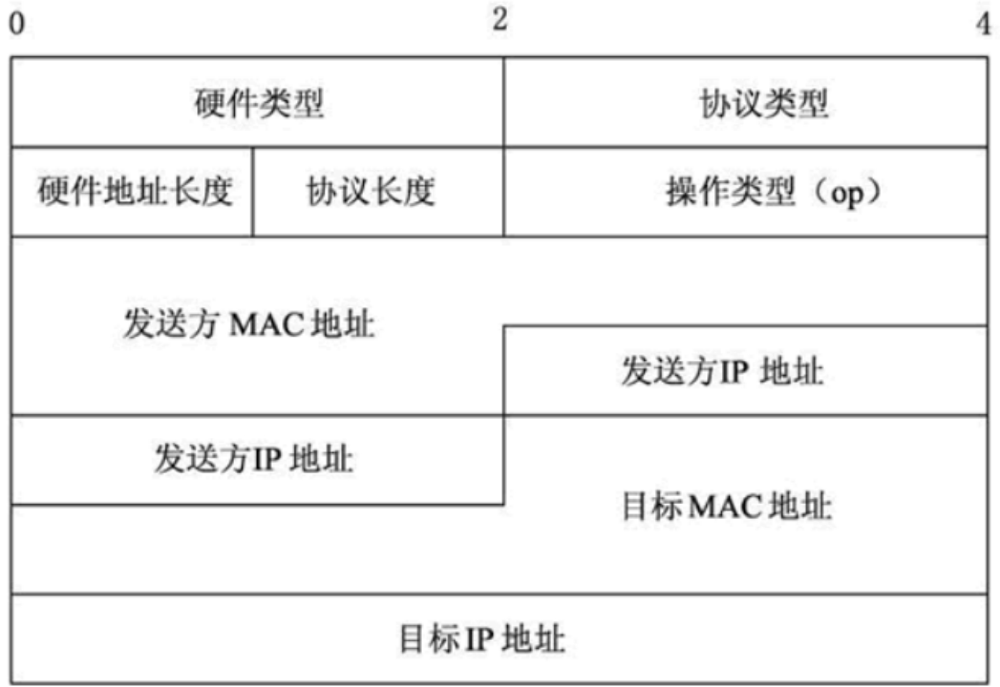

ARP报文的总长度为64字节。首先要知道帧的概念 帧是在数据链路层传输的数据格式，比如以太网v2，以太网IEEE802.3和PPP等。所以Wireshark抓到的帧是包含帧头的，即包含以太网v2的帧头，长14 bytes；而ARP数据包的长度固定为28 bytes；帧总长度 = 帧头 + 网络层包头 + 传输层报文头 + 应用数据；而ARP请求中ARP包已经是最高层，之上没有传输层和应用层，所以总长度为：

帧总长度 = 帧头 + ARP包头 = 14 + 28 = 42 bytes；

而真正 发包的时为了保证以太网帧的最小帧长为64 bytes，会在报文里**添加一个padding字段**，用来填充数据包大小。


### 三、实验过程

#### 1.设计思路

- 初始化和设备选择
  - 首先获取和列出所有网络接口（网卡）
  - 用户可以根据列出的网卡列表，选择一个用于发送和接收ARP报文的网卡。
- 设置与过滤
  - 打开选定的网卡，并准备捕获通过该网卡传输的数据包，获取其IP
  - 设定过滤器，仅捕获ARP包，忽略其他类型的网络数据包。
- 发送ARP请求
  - 组装一个ARP请求数据包。这个请求通常是询问一个特定IP地址对应的MAC地址。
  - 将ARP请求发送到网络。
- 接收ARP响应
  - 捕获通过选定网络接口接收的ARP响应数据包。
  - 解析接收到的ARP响应，提取发送者的IP和MAC地址信息。


#### 2.实现代码

1. ARP包数据结构设计

   ```c++
   //arp_resolver.cpp
   #pragma pack(1)
   struct ARP_HEADER {
       u_short HardwareType; // 硬件类型
       u_short ProtocolType; // 协议类型
       u_char HardwareSize; // 硬件地址长度
       u_char ProtocolSize; // 协议地址长度
       u_short Operation; // 操作类型
       u_char SenderHardwareAddress[6]; // 发送方MAC地址
       u_char SenderProtocolAddress[4]; // 发送方IP地址
       u_char TargetHardwareAddress[6]; // 目的MAC地址
       u_char TargetProtocolAddress[4]; // 目标IP地址
   };
   #pragma pack()   //恢复缺省对齐方式
   
   //ethernet.h
   typedef struct  ether_header {
   	u_char  ether_dhost[ETHER_ADDR_LEN]; //目的MAC
   	u_char  ether_shost[ETHER_ADDR_LEN]; //源MAC
   	u_short ether_type; //类型
   } ether_header_t;
   ```

2. 获取网卡列表，并打印相关信息

   ```cpp
      if (pcap_findalldevs(&alldevs, errbuf) == -1){
           printf("Error in pcap_findalldevs_ex: %s\n", errbuf);
           return 1;
       }
   	int i = 0;
   	for (dev = alldevs; dev; dev = dev->next,++i){
   		printf("设备%d: %s\n", i, dev->name);
           std::string command = "system_profiler SPNetworkDataType | grep -A1 " + std::string(dev->name);
           std::string output = exec(command.c_str());
           if(output.length() == 0) std::cout << "Description: " << "No description" << std::endl;
           else std::cout << "Description: " << std::endl << output;
   	}
   
   	if (i == 0)
   	{
   		printf("\n没有发现网络接口,请检查设备\n");
   		return 0;
   	}
   ```

   由于MacOS的限制，无法直接通过`d->description`直接获取设备信息。此处我在遍历网络设备时，对于每个设备，构建一个调用`system_profiler`并筛选特定设备名的命令。

   ```bash
   system_profiler SPNetworkDataType | grep -A1 + (string)
   ```

   `system_profiler`是一个命令行工具，用来显示关于系统硬件和软件配置的详细信息。使用`SPNetworkDataType`选项，它可以提供关于网络设置的详细信息，包括每个网络接口的配置详情，如以太网、Wi-Fi等。`grep`是一个用于搜索文本的命令行工具。它可以用来搜索包含特定模式（比如文本或正则表达式）的行，并将匹配的行输出到终端。`-A1`这个选项指示`grep`命令在输出匹配行的同时，还要输出该行之后的1行。这样，每当`grep`找到一个匹配项，它不仅会显示匹配的那行，还会显示接下来的一行。命令后面紧跟着一个模式，即`grep -A1 'pattern'`，其中`pattern`是我们希望查找的文本。

   为了能够在代码中执行传递给它的shell命令，并捕获该命令的输出结果，我定义了一个`exec`函数：

   ```cpp
   std::string exec(const char* cmd) {
       std::array<char, 128> buffer; //字符数组缓冲区来存储命令行输出读取的数据。
       std::string result; //累积从命令行输出读取的所有数据。
       std::unique_ptr<FILE, decltype(&pclose)> pipe(popen(cmd, "r"), pclose); //使用popen函数执行传递进来的命令cmd，并打开一个读取的管道。popen函数返回一个FILE指针，这个指针可以用来读取命令的输出。
       if (!pipe) {
           throw std::runtime_error("popen() failed!");
       }
       while (fgets(buffer.data(), buffer.size(), pipe.get()) != nullptr){
          //使用fgets函数从管道中读取数据，每次最多读取buffer.size()个字符
           result += buffer.data();
       }
       return result;
   }
   ```

   也可以使用`System Configuration framework`或者`Core Foundation framework`中的API来获取网络接口的信息，这些都是苹果提供的原生API集。**Objective-C** 通常与 Cocoa 和 Cocoa Touch 框架一起使用，这些框架为 macOS 和 iOS 提供了丰富的接口。PS:

   ```objective-c
   // File name: main.mm
   #include <SystemConfiguration/SystemConfiguration.h>
   //引入SystemConfiguration框架的头文件，以便使用其网络配置功能。
   #include <iostream>
   
   int main() {
       //调用SCNetworkInterfaceCopyAll函数获取系统中所有网络接口的数组。
       CFArrayRef interfaceArray = SCNetworkInterfaceCopyAll();
       //使用CFArrayGetCount函数获取数组中网络接口的数量
       CFIndex numberOfInterfaces = CFArrayGetCount(interfaceArray);
       for (CFIndex i = 0; i < numberOfInterfaces; i++) {
           // 通过索引获取数组中的一个网络接口的引用
           SCNetworkInterfaceRef interface = (SCNetworkInterfaceRef)CFArrayGetValueAtIndex(interfaceArray, i);
           // 获取网络接口的本地化显示名称，返回一个CFStringRef，是指向Core Foundation字符串的引用。
           CFStringRef name = SCNetworkInterfaceGetLocalizedDisplayName(interface);
           // 计算获取的本地化名称的长度
           CFIndex nameLength = CFStringGetLength(name) + 1;
           char* nameCString = (char*)malloc(nameLength);
           // 将Core Foundation字符串转换成C风格的字符串，使用UTF-8编码。
           CFStringGetCString(name, nameCString, nameLength, kCFStringEncodingUTF8);
           std::cout << "Interface " << i << ": " << nameCString << std::endl;
           free(nameCString);
       }
       CFRelease(interfaceArray);
       return 0;
   }
   ```

   结果如下：

   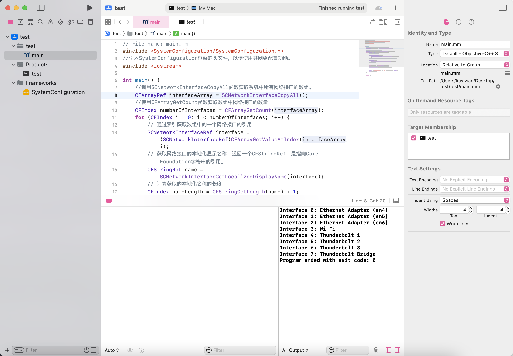

3. 选取网卡并打印其信息

   在上面的命令行中就可以看到IP地址了，但是我通过设备地址`d->addr`也可以获取。

   ```cpp
   	printf("\n输入要选择打开的网卡号 (0-%d):\t", i-1);
       int devIndex;
   	scanf("%d",&devIndex);
   	if (devIndex < 0 || devIndex >= i) {
   		printf("\n网卡号超出范围\n");
   		pcap_freealldevs(alldevs); //释放设备列表
   		return 0;
   	}
       for (dev = alldevs, i = 0; i < devIndex; dev = dev->next, ++i) ;
   
   	// 获取本地IP和掩码
   	char ipString[INET_ADDRSTRLEN]; // 用于存储IP地址字符串
       char maskString[INET_ADDRSTRLEN]; // 用于存储掩码地址字符串
       const char *ipSrc; // 指向转换后的IP字符串
       const char *maskSrc; // 指向转换后的掩码字符串
       pcap_addr_t *d;
   	for(d = dev->addresses;d!=NULL;d=d->next){
   		if (d->addr->sa_family == AF_INET){
   			if (d->addr) {
   				ipSrc = inet_ntop(AF_INET, &((struct sockaddr_in*)d->addr)->sin_addr, ipString, sizeof(ipString));
   				printf("本地IPv4地址为: %s\n", ipSrc);
   			}
   			if (d->netmask) {
   				maskSrc = inet_ntop(AF_INET, &((struct sockaddr_in*)d->netmask)->sin_addr, maskString, sizeof(maskString));
   				printf("IPv4掩码为: %s\n", maskSrc);
   				printf("hello!");
   			}
   			break;
       	}
   	}
   ```

4. 根据选择打开对应的网卡

   ```cpp
     pcap_t *adhandle= pcap_open_live(dev->name, 65536, 1, 2000, errbuf);
   	if (adhandle == NULL) {
   		printf("\n无法打开适配器!请检查设备\n");
   		pcap_freealldevs(alldevs);
   		return 0;
   	}
   ```

5. 构造ARP包，广播获取本机的MAC地址

   前面可以获取本机的IP地址，但是由于MacOS上MAC地址也需要使用Objective-c++进行获取，因此我选择采用另一种方式：自行构造一个ARP包广播，通过返回的ARP包来获取本机的MAC地址。

   ```cpp
   	//发送ARP包来获取本机MAC地址
   	u_char myMAC[6];
   	uint8_t sendbuf[42]; //包体缓冲区
   	ether_header eth;
   	ARP_HEADER arp;
   	pcap_pkthdr *pkth; //包体结构体
   	const uint8_t* pktdata; //包体数据包
   	memset(eth.ether_dhost,(uint8_t)0xff,6); //目的MAC，为ff:ff:ff:ff:ff:ff,广播
   	memset(eth.ether_shost,0x00,6); //源MAC随便写
   	eth.ether_type=htons(0x0806); //表示eth上层协议为ARP
   
   	arp.HardwareType=htons(1); //链路层为以太网
   	arp.ProtocolType=htons(0x0800); //ARP上层协议为IP
   	arp.HardwareSize = 6; //48位MAC
   	arp.ProtocolSize = 4; //32位IP
   	arp.Operation = htons(1); //此包为ARP请求
   
   	memset(arp.SenderHardwareAddress,0x00,6); //源MAC，和上面一样
   	memset(arp.TargetHardwareAddress,(uint8_t)0x00,6); //目的MAC地址，随便写的
   	inet_pton(AF_INET, ipSrc, &arp.SenderProtocolAddress); //源IP，使用本机IP
   	inet_pton(AF_INET, ipSrc, &arp.TargetProtocolAddress); //目的IP，使用本机IP
   
   	memset(sendbuf,0,sizeof(sendbuf));
   	memcpy(sendbuf,&eth,sizeof(eth));
   	memcpy(sendbuf+sizeof(eth),&arp,sizeof(arp));
   
   	if(pcap_sendpacket(adhandle,sendbuf,42)!=0){
   		printf("发送ARP请求失败!\n");
   		return 0;
   	}
   	printf("发送ARP请求成功!\n");
   
   	while (1)
   	{
   		int result = pcap_next_ex(adhandle, &pkth, &pktdata);
   		if(result < 0 ){
   			printf("捕获数据包发生错误\n");
   			return 0;
   		}
   		else if(result == 0){
   			printf("没有捕获到数据包\n");
   			break;
   		}
   		else{
   			unsigned char *temp=NULL;
   			ether_header *neweth = (ether_header*)(pktdata);
   			ARP_HEADER *newarp = (ARP_HEADER *)(pktdata+sizeof(ether_header));
   			if(ntohs(neweth->ether_type) == 0x0806 && ntohs(newarp->Operation) == 0x0002 && memcmp(newarp->TargetProtocolAddress,arp.SenderProtocolAddress,4) == 0){ //检查是否是我们需要的ARP包
   				printf("本机的MAC地址如下:\n");
   				for(int i=0;i<6;i++){
   					myMAC[i] = newarp->TargetHardwareAddress[i];
   					printf("%02x",myMAC[i]);
   					if(i<5) printf(":");
   				}
   				printf("\n");
   				break;
   			}
   		}
   	}
   ```

   在自行构造的ARP包中有一些地址是不知道的，先随便写一个，不会影响我们发的报文。使用wireshark捕获我们的ARP包，结果如下：

   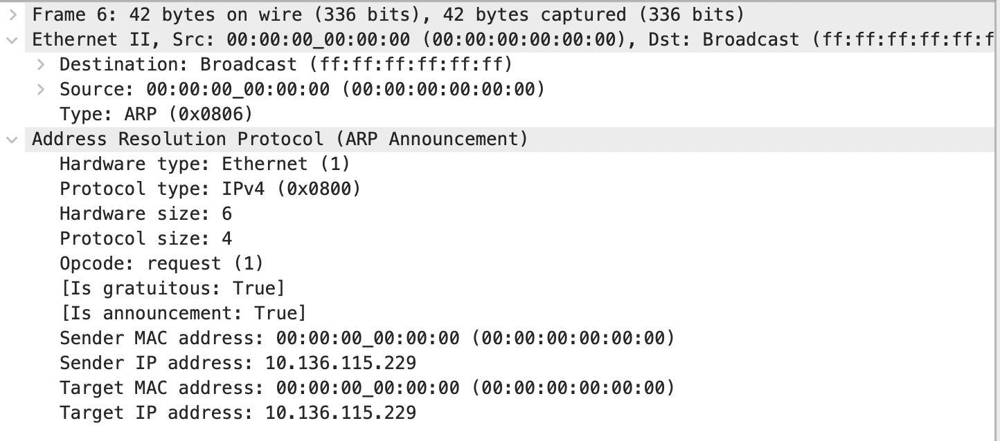

   发现数据都和我们写的一样，说明我们写的是正确的。

6. 输入目的IP地址，构造ARP包获取目的IP的MAC地址

   首先写了一个send函数，与上面构造ARP包获取本机MAC地址的代码很相似，将我们已有的MAC地址和IP地址填进去就可以了。

   ```cpp
   void send_arp_request(pcap_t *adhandle,in_addr local_ip,u_char *local_mac,in_addr target_ip){
   	u_char packet[sizeof(ether_header) + sizeof(ARP_HEADER)];
   	ether_header *eth = (ether_header *)packet;
      ARP_HEADER *arp = (ARP_HEADER *)(packet + sizeof(ether_header));
   	//填充以太网帧的头部
   	for(int i=0;i<6;i++){
   		eth->ether_dhost[i] = 0xff;
   		eth->ether_shost[i] = local_mac[i];
   	}
   	eth->ether_type = htons(0x0806);
   	//arp头
   	arp->HardwareType = htons(1); // 1代表链路层为Ethernet
   	arp->ProtocolType = htons(0x0800);	// ARP上层协议为IP 
   	arp->HardwareSize = 6; //48位MAC
   	arp->ProtocolSize = 4; //32为IP
   	arp->Operation = htons(0x0001); //1代表此包为ARP请求
   	for(int i=0;i<6;i++){
   		arp->SenderHardwareAddress[i] = local_mac[i];
   		arp->TargetHardwareAddress[i] = 0x00;
   	}
   	memcpy(arp->SenderProtocolAddress,&local_ip.s_addr,4);
   	memcpy(arp->TargetProtocolAddress,&target_ip.s_addr,4);
   	int result = pcap_sendpacket(adhandle,packet,sizeof(packet));
   	if(result == -1){
   		printf("发送失败!\n");
   	}
   	else if(result == 0){
   		printf("发送成功！正在等待ARP响应！\n");
   	}
   }
   ```

   然后使用receive函数获取ARP响应

   ```cpp
   bool receive_arp_response(pcap_t *adhandle, in_addr target_ip, u_char *target_mac){
   	struct pcap_pkthdr *header;
   	const u_char *packet;
   	while(pcap_next_ex(adhandle,&header,&packet) >= 0){
   		ether_header *eth = (ether_header *)packet;
   		if(ntohs(eth->ether_type) !=0x0806) continue;
   		ARP_HEADER *arp = (ARP_HEADER *)(packet+sizeof(ether_header));
   		if(ntohs(arp->Operation) == 0x0002 && memcmp(arp->SenderProtocolAddress,&target_ip.s_addr,4) == 0){
   			memcpy(target_mac,arp->SenderHardwareAddress,6);
   			return true;
   		}
   	}
   	return false;
   }
   ```

   也与刚才的响应部分类似，只有最后是将获取到的ARP包的发送方的MAC地址填入我们的目的MAC地址，刚才的是通过接收方的MAC地址来得到本机MAC地址的～

   ```cpp
   	//main函数
   	printf("请输入目标IP地址:\n");
   	char target_ip_str[20];
   	scanf("%s",target_ip_str);
   	in_addr target_ip;
   	inet_pton(AF_INET,target_ip_str,&target_ip);
   	u_char target_mac[6];
   	send_arp_request(adhandle,local_ip,myMAC,target_ip);
   	if(receive_arp_response(adhandle,target_ip,target_mac)){
   		printf("目标MAC地址如下:\n");
   		for(int i=0;i<6;i++){
   			printf("%02x",target_mac[i]);
   			if(i<5) printf(":");
   		}
   		printf("\n");
   	}
   	else{
   		printf("未收到ARP响应!\n");
   	}
   ```

   使用wireshark捕获ARP响应，包内容如下：

   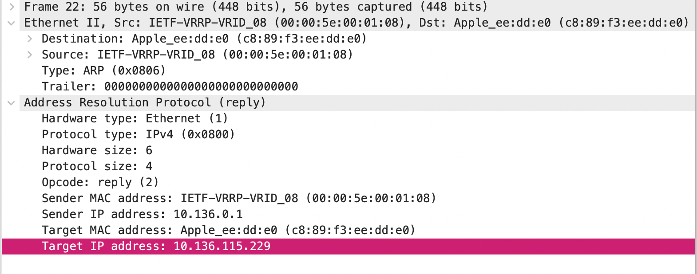


### 四、结果验证

实验截图如下：

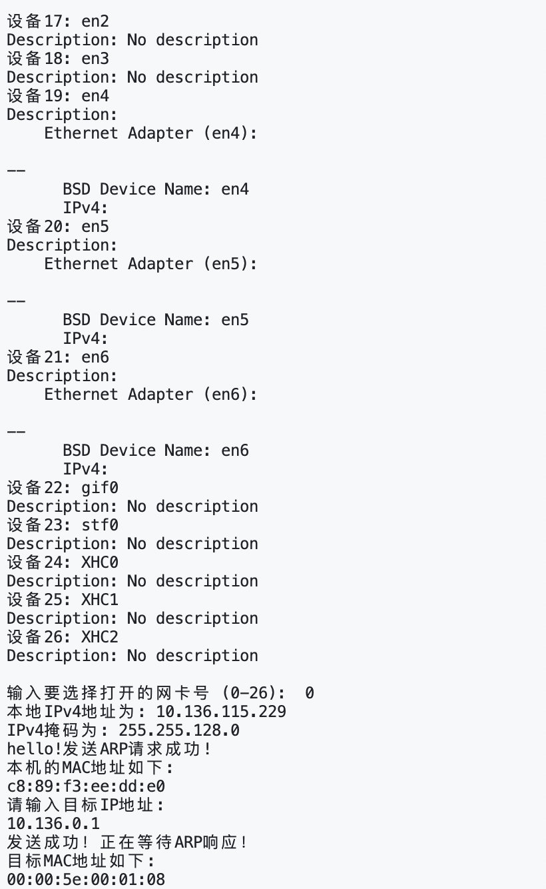

分析如下：
将netmask转换为二进制形式：255.255.128.0 -> 11111111.11111111.10000000.00000000

将IP地址也转换成二进制形式： 10.136.115.229 -> 00001010.10001000.01110011.11100101

对齐如下：

```yaml
   IP Address:    00001010.10001000.01110011.11100101
   Subnet Mask:   11111111.11111111.10000000.00000000
                  -----------------------------------
   Network Part:  00001010.10001000.00000000.00000000
```

将上面的网络部分转换回十进制形式得到网络地址：10.128.0.0。

由于子网掩码255.255.128.0在第三个八位组中最高位为1，其余为0，这表明该子网可以有2^7=128个可用网络，每个网络可以有2^8+8−2=6553428+8−2=65534个可用的主机地址（减去的2个地址分别是网络地址和广播地址）。

- 网络地址是 10.128.0.0
- 可用的主机IP范围是从 10.128.0.1 到 10.128.255.254
- 广播地址是 10.128.255.255（所有主机位都是1）

我的IP地址10.136.115.229落在这个范围内，所属的具体网络是10.128.0.0/17。这意味着本机在10.128.0.0网络中，主机标识是115.229。


### 五、其他补充

#### 1.获取本机MAC地址

注意到获取本机MAC地址的时候，因为不知道自己的MAC地址，发送的ARP包的MAC地址是随便填的，原本应该对方收到之后不知道回复，但是实际上仍然能收到回信，并且是由服务器IP`10.136.0.1`发送的～

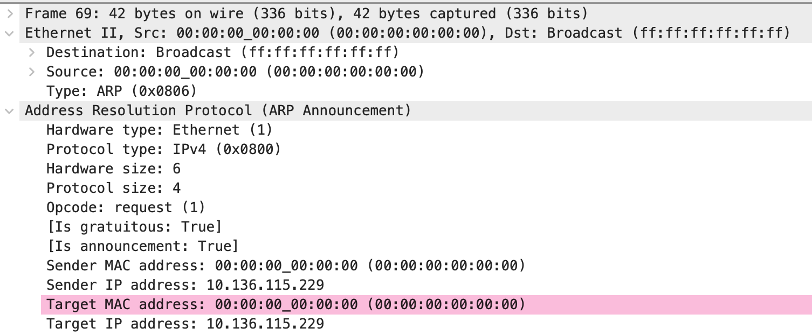


#### 2.WireShark重复的MAC地址

有一个MAC地址 `00:00:5e:00:01:08` 出现在多个ARP回应中。

这个MAC地址与 Virtual Router Redundancy Protocol (VRRP) 有关。VRRP是一个用于实现高可用性的网络协议，通过在局域网内多台路由器之间共享一个**虚拟MAC地址来实现**。这个地址通常是一个特定格式的MAC地址，其中 `00:00:5e` 是**IEEE分配给VRRP的MAC地址前缀**。

在截图中，多次出现的 `IETF-VRRP-VRID_08` 表示是一个VRRP虚拟路由器的标识符，`VRID` 表示虚拟路由器标识符，后面的数字（如08）是虚拟路由器的ID号。ARP回应指示多个IP地址被映射到同一个MAC地址，这意味着这些IP地址可能都是绑定到同一个VRRP虚拟路由器上。

因此，这些ARP回应可能是表示，所有向这些IP地址发送ARP请求的数据包都应该发往VRRP配置的MAC地址 `00:00:5e:00:01:08`。这是一种负载均衡和故障转移机制，允许多台物理路由器共享一个虚拟IP地址，并确保网络流量在一台路由器发生故障时可以无缝转移到另一台上。这是为了确保网络的持续可用性和稳定性。

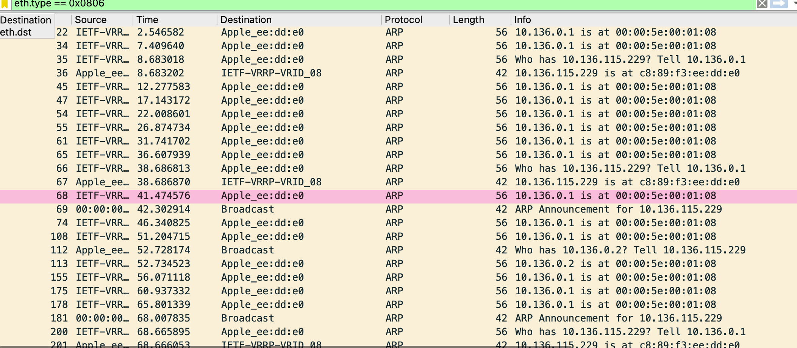


#### 3.如何获取可以访问的IP地址

由于使用的是校园网，想要知道那一些IP地址是正在使用的。

```bash
homebrew install arp-scan
sudo arp-scan --interface=en0 --localnet
```

结果：

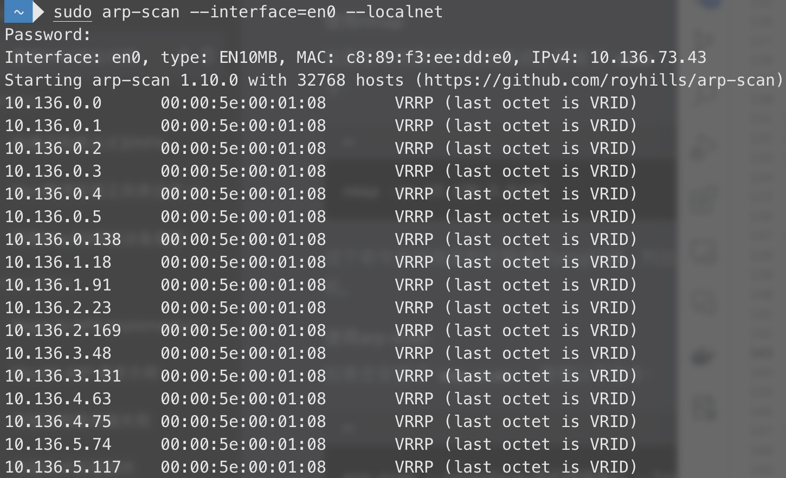

使用这个工具可以查找到本机IP所在的虚拟局域网内的所有主机～

并且注意到校园网内所有IP的MAC地址都是`00:00:5e:00:01:08` ，和第二点中在wireshark观察到的现象一样。


#### 4.VRRP协议

VRRP（Virtual Router Redundancy Protocol）是一种容错协议，用于提高局域网内默认网关的可用性。这个协议的目标是在一组路由器中自动选举出一个主路由器，来承担路由功能，而当这个路由器出现故障时，另一个路由器会自动接管这一职责，从而实现无缝切换。

VRRP是一个开放标准，定义在RFC 5798文档中，适用于IPv4和IPv6网络。

##### 工作原理

1. **多台路由器组成一个组**：在VRRP中，会有多台路由器组成一个VRRP组（也称为VRRP实例），每个组都会有一个虚拟IP地址（VIP），这个地址是该组中所有路由器共享的，也是局域网中其他设备设置为默认网关的地址。
2. **选举主路由器**：VRRP通过一个选举过程来决定哪台路由器作为主路由器。每台路由器都有一个优先级值，这个值通常是基于其IP地址或者可以手动设置。默认情况下，拥有最高优先级的路由器会成为主路由器。
3. **主路由器的职责**：主路由器会将VIP地址关联到它的某个网络接口上，并负责向局域网内的其他设备宣告它是默认网关。主路由器还会定期发送VRRP通告消息，以表明它是活跃的。
4. **备份路由器的作用**：其他的路由器则处于备份状态，它们会监听来自主路由器的VRRP通告消息。如果备份路由器在预定的时间内没有收到主路由器的通告，它会认为主路由器出现了故障。
5. **主路由器故障时的行为**：当备份路由器认为主路由器出现了故障（如它停止发送VRRP通告），备份路由器中优先级最高的会接管成为新的主路由器。新的主路由器会将VIP地址绑定到自己的网络接口上，并开始向局域网内的设备发送通告。

##### MAC地址和VRRP

在VRRP中，使用特殊的MAC地址是非常重要的，因为这样可以确保网络中的其他设备在主路由器切换时无需更新ARP表。这个特殊的MAC地址是一个“虚拟”MAC，通常形式为`00:00:5e:00:01:xx`，其中`xx`是VRRP虚拟路由器的ID。因此，无论哪个路由器成为主路由器，它都会使用这个虚拟MAC地址。

##### 使用场景

VRRP最常见的使用场景是在企业网络环境中，保证网络的稳定性和可靠性。如果企业网络中的默认网关设备出现故障，会对企业造成重大的业务影响。使用VRRP可以减少这种故障对业务的影响。

##### 注意事项

- **VRRP并不是路由协议**：它不会决定数据包该如何在网络中传输，它只是确保了数据包有一个可靠的出口点。
- **VRRP不提供负载均衡**：虽然可以配置多个VRRP组来分散流量，但VRRP本身并不会在备份路由器之间分配负载。
- **安全性**：VRRP通告可以被认证来防止非法的VRRP通信。


#### 5.ARP缓存表

使用`arp -a`可以查看自己本机的ARP缓存表，该表记录IP地址与MAC地址的映射关系。

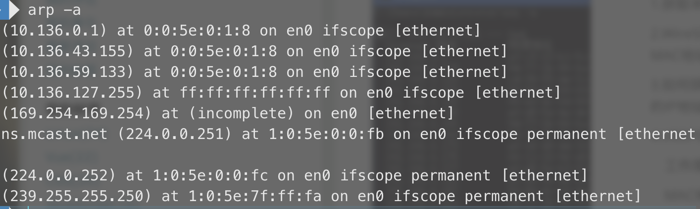

##### ARP映射方式

1. **静态映射**

静态映射的意思是要手动创建一张ARP表，把逻辑（IP）地址和物理地址关联起来。这个ARP表储存在网络中的每一台机器上。例如，知道其机器的IP地址但不知道其物理地址的机器就可以通过查ARP表找出对应的物理地址。这样做有一定的局限性，因为物理地址可能发生变化：

（1）机器可能更换NIC（网络适配器），结果变成一个新的物理地址。

（2）在某些局域网中，每当计算机加电时，他的物理地址都要改变一次。

（3）移动电脑可以从一个物理网络转移到另一个物理网络，这样会时物理地址改变。

要避免这些问题出现，必须定期维护更新ARP表，此类比较麻烦而且会影响网络性能。

2. **动态映射**

动态映射时，每次只要机器知道另一台机器的逻辑（IP）地址，就可以使用协议找出相对应的物理地址。已经设计出的实现了动态映射协议的有ARP和RARP两种。ARP把逻辑（IP）地址映射为物理地址。RARP把物理地址映射为逻辑（IP）地址。


#### 6.使用docker容器验证

我们知道同一个docker网络内的容器之间是可以通过IP地址映射到MAC地址的。打开两个docker容器，并把代码移植进去，我们也可以使用容器进行验证～

首先使用一下代码创建容器：
```bash
docker pull ubuntu:20.04
docker run -itd --name test ubuntu:20.04 /bin/bash
docker run -itd --name test1 ubuntu:20.04 /bin/bash
docker network inspect bride
```

最后的命令会输出：
```bash
[
    {
        "Name": "bridge",
        "Id": "a30e844fd498fce741b74be2649ccee046a7d7499e47f0207abffd823b33a19a",
        "Created": "2023-11-07T03:02:12.961720667Z",
        "Scope": "local",
        "Driver": "bridge",
        "EnableIPv6": false,
        "IPAM": {
            "Driver": "default",
            "Options": null,
            "Config": [
                {
                    "Subnet": "172.17.0.0/16",
                    "Gateway": "172.17.0.1"
                }
            ]
        },
        "Internal": false,
        "Attachable": false,
        "Ingress": false,
        "ConfigFrom": {
            "Network": ""
        },
        "ConfigOnly": false,
        "Containers": {
            "1368eece0ccad4811b5c23714d082920a0ce3ac97b4552b59f3783955ad82a1b": {
                "Name": "test",
                "EndpointID": "9380c574adc26d68eb1a6291ab34635f248c8d2f9a6b289090ae03bf36074fb5",
                "MacAddress": "02:42:ac:11:00:02",
                "IPv4Address": "172.17.0.2/16",
                "IPv6Address": ""
            },
            "1bb41383b0395564cb5efe583e83b7cc0954d9dd9165225e58d7737747accd0e": {
                "Name": "test2",
                "EndpointID": "0fe58b3a1311db34f74aa5bf0afc5d4131537bb49e862076d16b0a0a4b8dbda6",
                "MacAddress": "02:42:ac:11:00:04",
                "IPv4Address": "172.17.0.4/16",
                "IPv6Address": ""
            },
            "738bf0a4439bf167bd9eeb149eb86fbfcf0e8ecb785f587487924b8ed23c6cd8": {
                "Name": "test1",
                "EndpointID": "26ff4b1f6e2dacad7bc868781e1a8a5f3621f2ab90716db133201eb75c8692a1",
                "MacAddress": "02:42:ac:11:00:03",
                "IPv4Address": "172.17.0.3/16",
                "IPv6Address": ""
            }
        },
        "Options": {
            "com.docker.network.bridge.default_bridge": "true",
            "com.docker.network.bridge.enable_icc": "true",
            "com.docker.network.bridge.enable_ip_masquerade": "true",
            "com.docker.network.bridge.host_binding_ipv4": "0.0.0.0",
            "com.docker.network.bridge.name": "docker0",
            "com.docker.network.driver.mtu": "1500"
        },
        "Labels": {}
    }
]
```

可以看到我们创建的容器都在同一个docker网络中。

将代码移植到test之后，运行

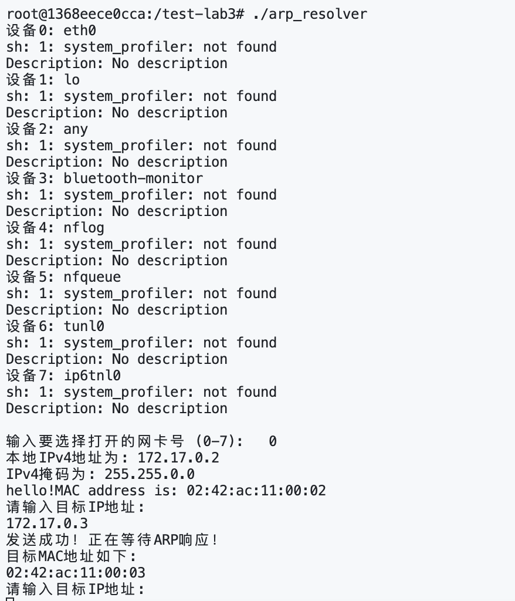

输入目标容器test1的IP地址，可以使用`ifconfig`命令获取：

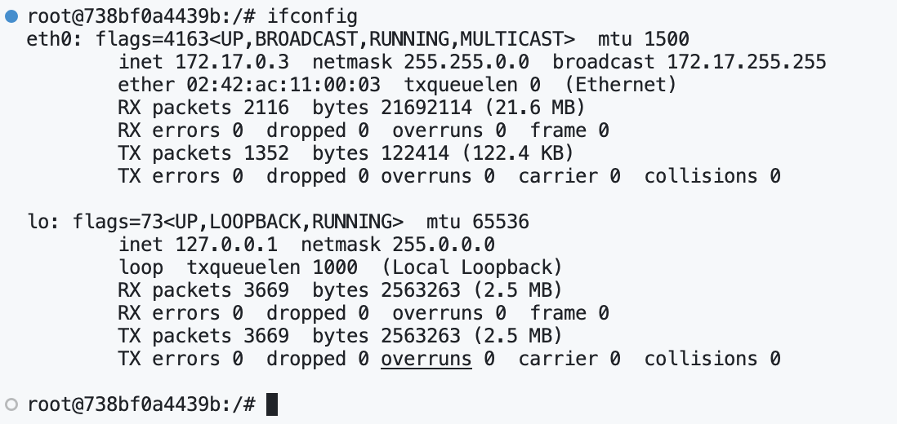

可以看到成功获取到目标MAC地址，并且对比发现结果正确！🎉


### 六、Github链接
