<h2><center>lab6：NAT的配置</center></h2>

<h5><center>2112614 刘心源</center></h5>

### 一、实验内容

#### 仿真环境下的NAT服务器配置

在仿真环境下完成NAT服务器的配置实验，要求如下：

（1）学习路由器的NAT配置过程；

（2）组建由NAT连接的内网和外网；

（3）测试网络的连通性，观察网络地址映射表；

（4）在仿真环境的“模拟”方式中观察IP数据报在互联网中的传递过程，并对IP数据报的地址进行分析。

#### 仿真环境下完成如下实验

将内部网络中放置一台Web服务器，请设置NAT服务器，使外部主机能够顺利使用该Web服务。


### 二、实验原理

#### NAT

网络地址转换（NAT）是一种网络技术，它允许一个IP地址空间内的多个设备映射到另一个IP地址空间。NAT常用于将私有（非全球唯一）IP地址转换为公有IP地址，从而使多个设备能够通过单个公有IP地址共享互联网连接。

##### 工作原理

1. **IP地址和端口转换**：
   - 在内网和外网之间的NAT设备（通常是路由器）会在内部网络和互联网之间进行IP地址的转换。
   - 内网设备拥有私有IP地址。当它们向互联网发送数据时，**NAT设备会将这些私有IP地址转换为公有IP地址**，并且可能会改变源端口号，以便区分来自同一私有IP地址的多个连接。

2. **连接跟踪**：
   - NAT设备会维护一张**NAT转换表**，这张表记录了内部设备的私有IP地址和端口号与公有IP地址和端口号之间的映射关系。
   - 当来自互联网的数据包到达NAT设备时，NAT设备会根据这张表来确定如何将数据包路由到正确的内部设备。

##### 类型

1. **静态NAT**：一对一地将私有IP地址映射到公有IP地址，通常用于需要从互联网可访问的服务器。

2. **动态NAT**：从一组公有IP地址中动态分配地址给内部设备，没有固定的私有IP到公有IP的映射关系。

3. **端口地址转换（PAT）**，也称为NAT过载：多个私有IP地址和端口号映射到单个公有IP地址的不同端口上。这是最常见的NAT类型，因为它节省了公有IP地址资源。

##### 优点

- **地址保护**：由于内网设备的真实IP地址不会暴露到互联网上，因此NAT提供了一定程度的安全保护。
- **公有地址节省**：NAT允许多个设备共享同一个公有IP地址，这在IPv4地址日益稀缺的情况下尤其有用。

##### 缺点

- **端到端连接问题**：NAT打破了互联网的端到端原则，可能导致某些需要直接IP连接的应用（如VoIP、P2P应用等）工作不正常。
- **性能限制**：NAT设备需要处理每个通过的数据包，这可能会成为网络的瓶颈。
- **地址转换跟踪**：NAT设备必须跟踪每个活动连接的状态，这增加了复杂性和资源消耗。


### 三、实验验证

#### （1）搭建实验所需组网，配置各设备端口IP

网路拓扑图如下：其中左半部分是内网，右半部分是外网

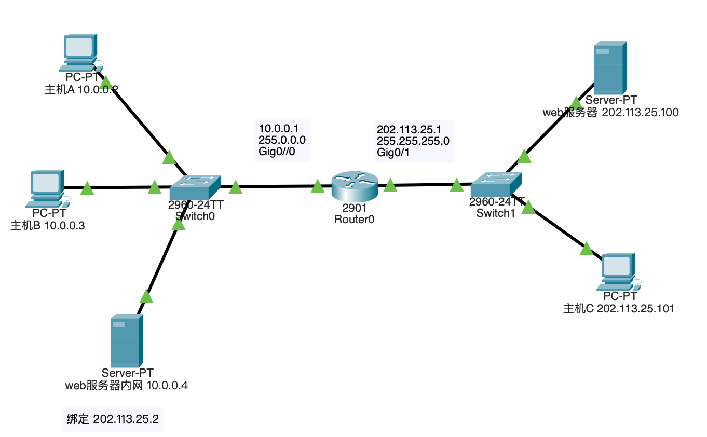

配置各设备的IP，方法在前面实验中多次提到（这里省略）。注意到**内网设备需要配置默认网关10.0.0.1**。因为内网设备通常配置为私有IP地址，这些地址在互联网上不是唯一的，也不可路由的。内网设备需要知道如何发送到非本地网络的数据包，即那些不在其直接连接的网络上的目的地。为此，它们需要一个默认网关，这是一个路由器的IP地址，该路由器知道如何将流量从内网路由到外部网络，比如互联网。

而**外网**通常已经是在一个大的、完全互联且可路由的网络环境中，它们可能已经有明确的路由协议在运行（如BGP在互联网上），这些协议定义了数据包如何在网络内传输。在这样的环境中，设备往往是通过直接连接来交换流量，可能**不需要默认网关**，因为它们已经在一个大的局域网中，这个局域网自身就有能力处理路由决策。


#### （2）配置路由器静态NAT

路由器NAT配置分为四步

1. 配置IP地址池

   在路由器的CLI窗口进行

   ```c
   enable  //进入特权级
   config terminal  //进入全局配置模式
   ip nat pool <PoolName> <Start IP> <EndIP> netmask <Mask>  // 配置一个IP池，规定了内网访问外网可以使用的全局IP
   ```

   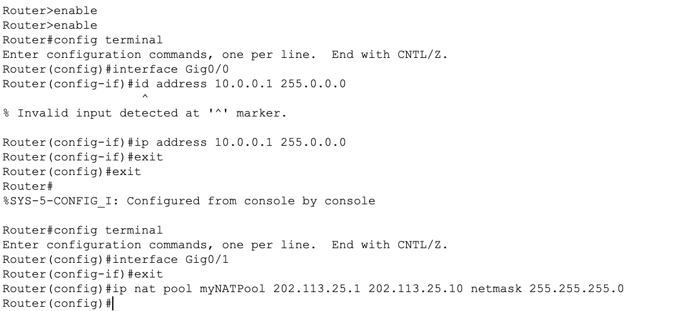

2. 配置标准访问列表

   ```c
   access-list <LabelID> permit <IDAddr> <WildMask>  //构建一个访问列表，指定内部网络的IP地址范围，其中WildMask是通配符和NetMask互为反码
   ```

3. 建立全局IP地址与内部私有IP地址关联

   ```c
   ip nat inside source list <LabelID> pool <PoolName> overload  //将一个IP池和一个访问列表绑定，overload代表采用NAPT
   ```

4. 指定内部、外部网络接口

   ```c
   interface <InerfaceName>  //进入对某个具体接口的配置
   ip nat outside/inside  //设置此接口为内网/外网接口
   ```

   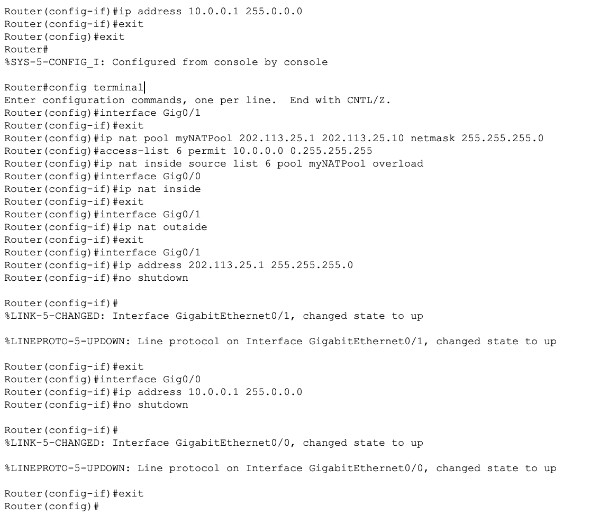


#### （3）测试网络的连通性，观察网络地址映射表

在内网主机A使用ping指令和tracert指令访问外网主机C检查网络连通性：

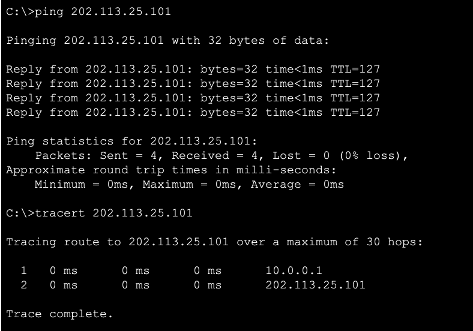

可以正常连通🎉

使用下面的指令去获取NAT转换统计表和NAT地址转换表：

```c
Show ip nat statistics  //获取NAT转换统计表
Show ip nat translations  //获取NAT地址转换表
```

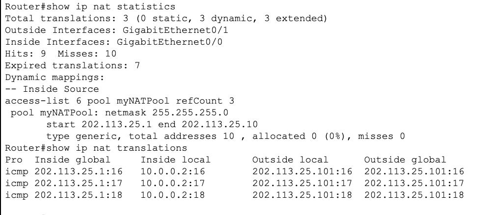


PS：**打开外网服务**

可以打开外网web服务器网络服务，然后使用主机A访问其网站。

在services界面把HTTP服务打开：


之后在PCA的web browser中输入服务器网址即可访问：


#### （4）在仿真环境的“模拟”方式中观察IP数据报在互联网中的传递过程，并对IP数据报的地址进行分析

在PCA使用ping命令访问外部网络服务器，并分析包中的地址

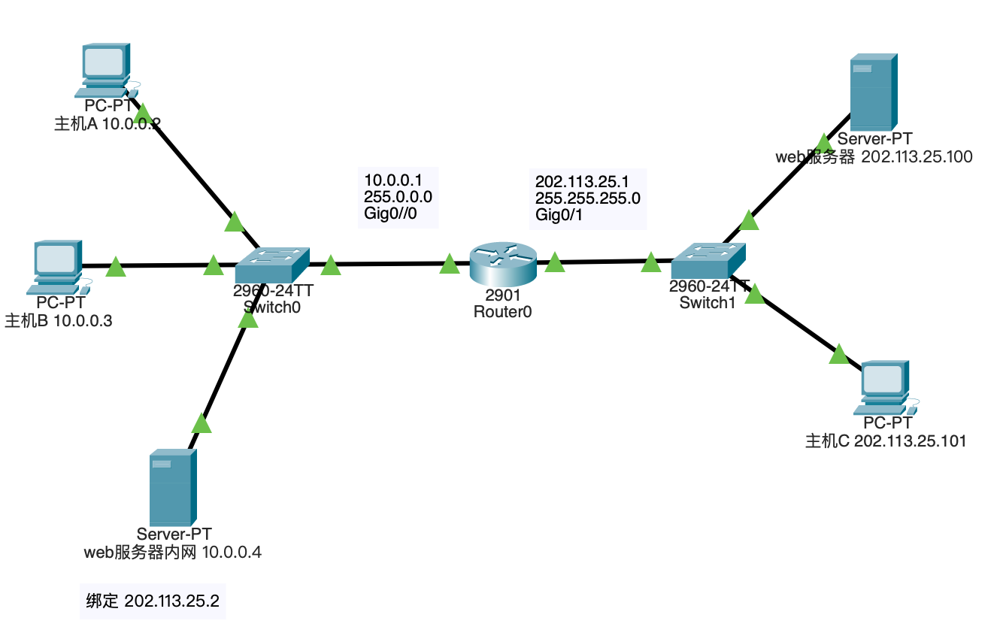

1. 报文在内部网络网传递的时候，源地址是内网地址，目的地址是外部网络web服务器的地址

   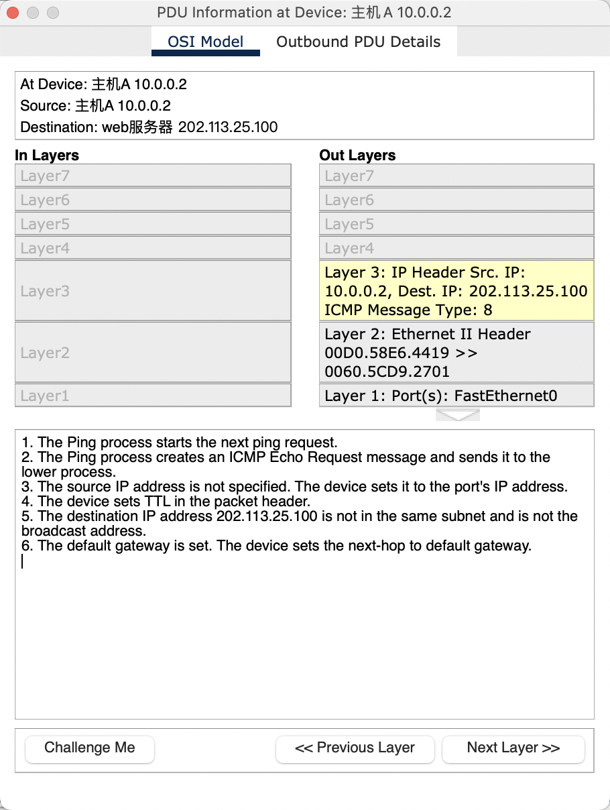

2. 在路由器处可以看到，路由器转发出的包的源地址是经过NAT转换之后的全局IP地址

   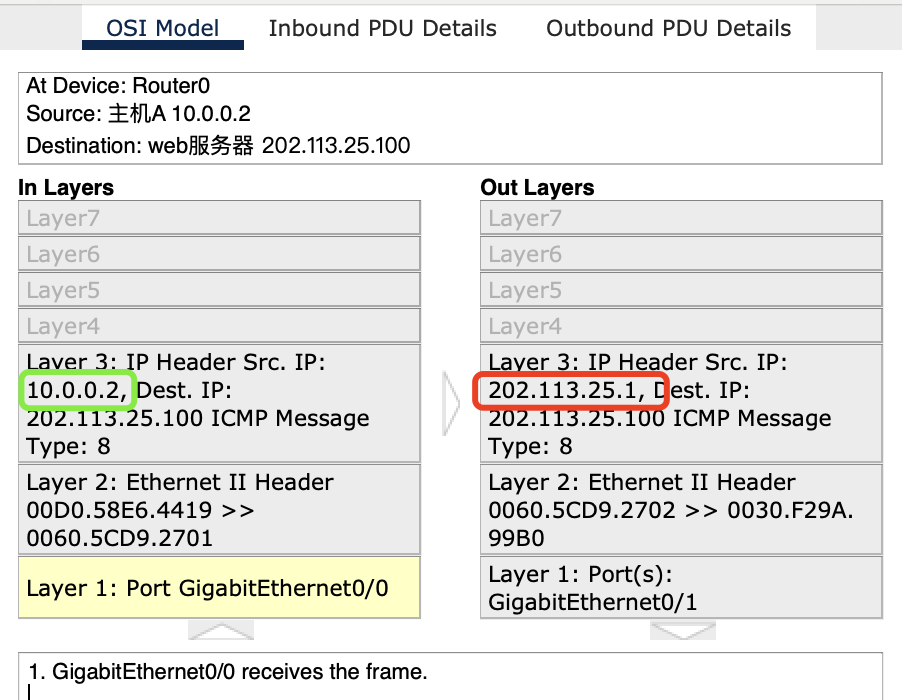

3. 服务器收到包之后，传回包的目的地址也是NAT转换后的全局IP地址

   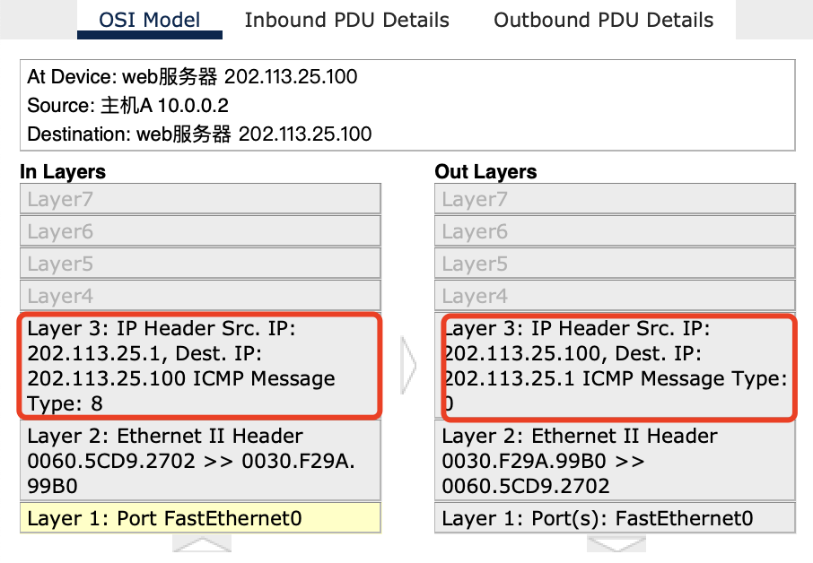

4. 返回包来到路由器Router0，路由器（NAT设备）再将全局IP转换为内部网络IP

   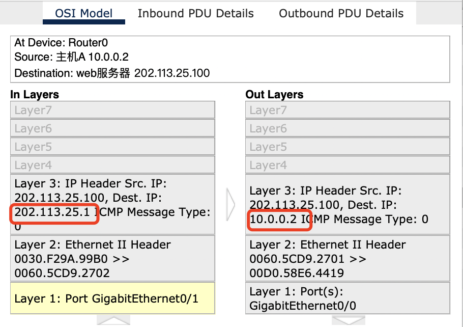

5. 最后PCA收到回传数据包，过程结束


#### （5）将内部网络中放置一台Web服务器，请设置NAT服务器，使外部主机能够顺利使用该Web服务

1. 可以在NAT表中添加一个静态表项，将一个内网IP和外网IP绑定即可。（10.0.0.4映射给202.113.25.2）

   ```c
   Ip nat inside source static 10.0.0.4 202.113.25.2  //为内网服务器私有IP绑定了全局IP
   Show ip nat translation  //查看NAT映射表
   ```

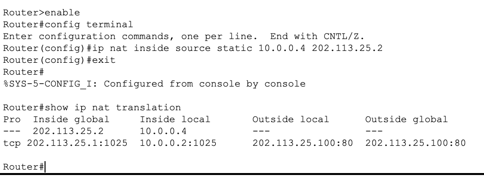

2. 打开内网服务器的HTTP服务并使用主机C访问内网服务器

   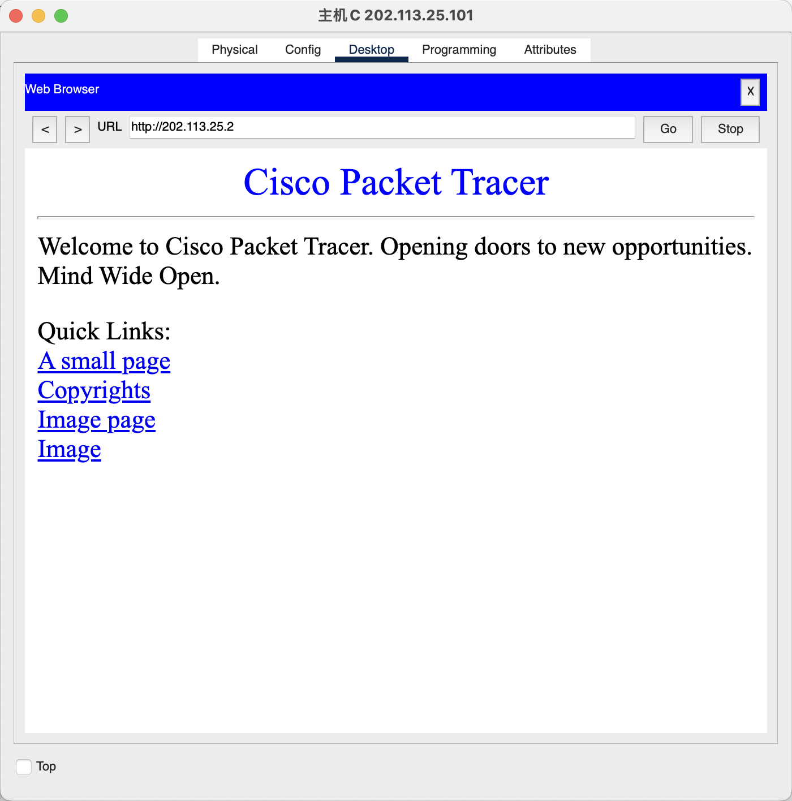


### 四、其他补充


#### **NAT转换统计表**

NAT转换统计表是NAT（网络地址转换）设备用来跟踪和管理内部网络（私有地址）与外部网络（如互联网上的公共地址）之间地址转换的数据结构。这个表是NAT功能的核心组成部分，它记录了NAT设备进行地址转换的每个实例的详细信息。以下是NAT转换统计表的主要部分解释：

- **Total translations**: 表明总共有3个NAT转换条目，所有这些都是动态的，并且包括3个扩展的转换。
- **Interfaces**: 显示外部接口是GigabitEthernet0/1，内部接口是GigabitEthernet0/0。
- **Hits/Misses**: 表明NAT转换尝试中有9次命中（成功）和10次未命中（失败）。
- **Expired translations**: 有7个NAT转换条目已经过期。
- **Dynamic mappings**: 显示了一个动态映射配置。它指定了一个访问控制列表（ACL）6，它与名为myNATPool的NAT池关联，该池的网段从202.113.25.1到202.113.25.10。

#### **NAT地址转换表**

输出显示了活动的NAT转换条目

- **Pro**: 协议，这里是`icmp`，即互联网控制消息协议，通常用于ping命令。
- **Inside global**: 表示从内部网络转换到外部网络时使用的全局（公共）地址。
- **Inside local**: 表示内部网络设备的本地（私有）地址。
- **Outside local**: 表示从外部网络发送到内部网络设备的本地（私有）地址。
- **Outside global**: 表示外部网络设备的全球（公共）地址。

输出显示了三个ICMP连接的NAT转换。例如，内部设备10.0.0.2在与外部设备通信时，其地址被转换为202.113.25.1的16至18端口。**这允许内部网络中的设备使用单个公共IP地址与外部世界通信，同时还可以使用不同的端口号区分不同的通信会话。**