<h2><center>lab7：防火墙和SSL实验</center></h2>

<h5><center>2112614 刘心源</center></h5>

### 一、实验内容

#### 防火墙实验

防火墙实验在虚拟仿真环境下完成，要求如下：

1. 了解包过滤防火墙的基本配置方法、配置命令和配置过程。

2. 利用标准ACL，将防火墙配置为只允许某个网络中的主机访问另一个网络。

3. 利用扩展ACL，将防火墙配置为拒绝某个网络中的某台主机访问网络中的Web服务器。

4. 将防火墙配置为允许内网用户自由地向外网发起TCP连接，同时可以接收外网发回的TCP应答数据包。但是，不允许外网的用户主动向内网发起TCP连接

#### SSL实验（选做）

1. 完成Web服务器的证书生成、证书审批、证书安装、证书允许等整个过程。

2. 实现浏览器与Web服务器的安全通信。


### 二、实验原理

#### ACL 

Access Control List 访问控制列表

**ACL（访问控制列表）**

- **定义**：ACL是一种网络设备（如路由器、交换机）上设置的规则列表，用于控制进出该设备的数据包。它决定了哪些类型的数据包可以通过，哪些应该被阻止。
- **工作原理**：当数据包到达一个带有ACL的网络设备时，设备会根据ACL中的规则来检查这个数据包。这些规则可以基于源地址、目的地址、端口号等多种信息来设置。
- **使用场景**：ACL通常用于提供基本的网络安全，限制网络流量，以及在网络设计中实现数据流的隔离和控制。


**ACL表的种类：**

1）标准ACL：表号1-99

标准ACL只能基于数据包的源IP对数据做过滤！

2）扩展ACL：表号100-199

扩展ACL可以基于数据包的源IP、目标IP、端口、协议等对数据做过滤


**ACL编写规则及应用原理：**

1）标准ACL尽量写在靠近目标端的地方

2）在所有ACL表的最后都有一条隐藏的拒绝所有条目

3）在匹配ACL时，是严格自上而下的匹配每一条的！

4）一个接口的一个方向上只能应用一张表！

5）默认情况下，一张标准或扩展ACL一旦编写完，不能删除某一条，也不能往中间

插入新的条目，只能往最后继续添加新的条目，如果需要更改或删除的话，只能删除整张表，再重新写！！


#### **防火墙**

- **定义**：防火墙是一种网络安全系统，它监控和控制进出网络的数据流量，基于预定的安全规则进行操作。它可以是软件也可以是硬件，或两者的组合。
- **工作原理**：防火墙检查穿过它的数据包，并根据设置的规则决定允许还是拒绝这些数据包。这些规则可以基于源和目的地的IP地址、传输控制协议（TCP）或用户数据报协议（UDP）端口等。
- **使用场景**：防火墙用于防止未经授权的网络访问，防止网络攻击和未授权的数据传输，也用于实施网络策略和记录和报告网络活动。


### 三、实验验证

#### （1）搭建实验所需组网，配置各设备端口IP

网路拓扑图如下：

各设备的IP配置与之前实验类似，不再赘述。同时注意配置各设备的默认网关以及**使用动态方式配置路由**。

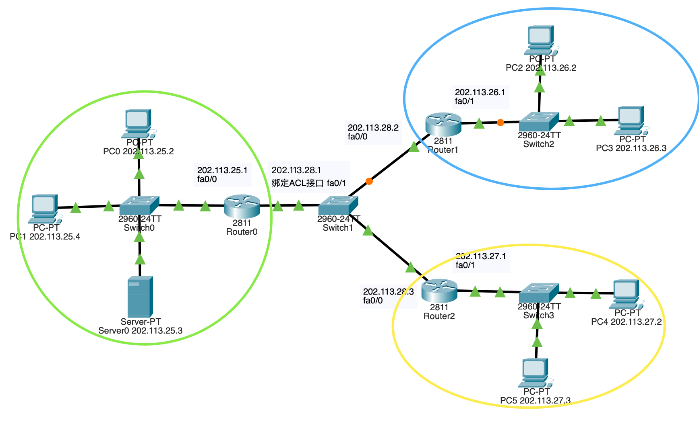

使用ping检查一下网络连通性，可以连通

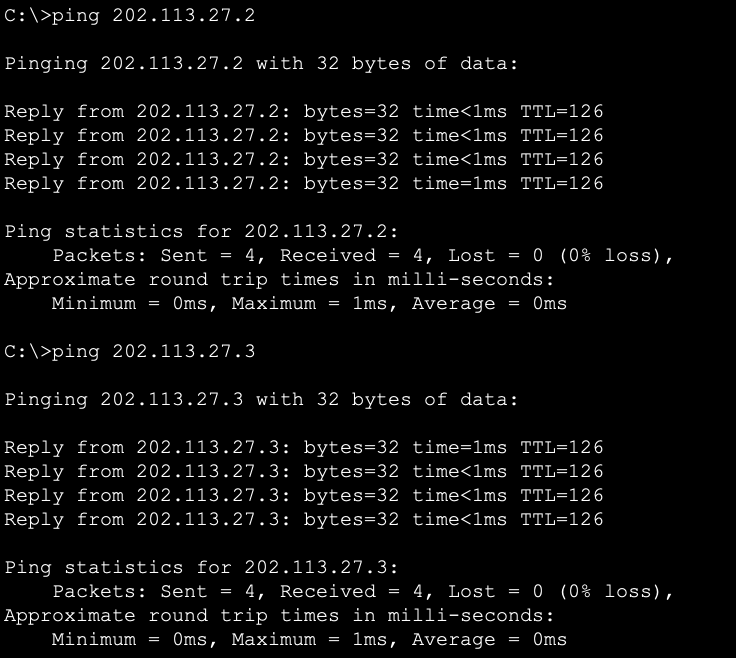


#### （2）利用标准ACL，将防火墙配置为只允许某个网络中的主机访问另一个网络

使用以下指令完成标准ACL配置：

```c
enable
config terminal  //进入全局配置模式
access-list 6 permit 202.113.26.0 0.0.0.255  //创造一个序号为6的访问控制列表，允许来自202.11.26.0/24 这个网络的报文通过
access-list 6 deny any  //拒绝任何报文通过 此规则优先级低于3）
interface fa0/1
ip access-group 6 in  //为端口Fa0/1的入站绑定ACL6
```

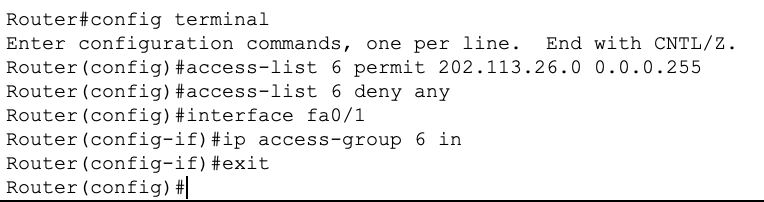


配置完毕后，使用ping命令测试网络连通性，发现Router0会阻拦来自`202.113.27.0`网络的报文而不会阻拦来自`202.113.26.0`的报文。

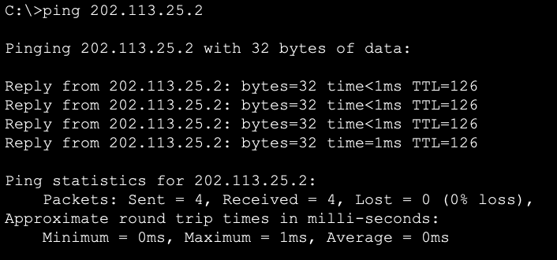


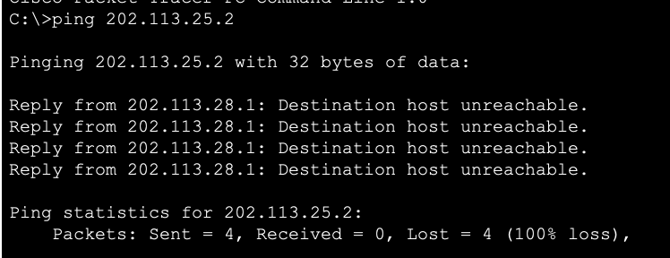


#### （3）利用扩展ACL，将防火墙配置为拒绝某个网络中的某台主机访问网络中的Web服务器

在路由器Router0的CLT界面下使用以下指令完成扩展ACL配置：

```c
enable
config terminal
access-list 106 deny tcp host 202.113.26.2 host 202.113.25.3 eq www  //创建一个序号为106的访问控制列表 抛弃从202.113.26.2向主机202.113.25.3:80发起的tcp数据报
access-list 106 permit ip any  //允许任何数据报通过，优先级低于3）
interface fa0/1
ip access-group 106 in  //为端口Fa0/1的入站绑定ACL106
```

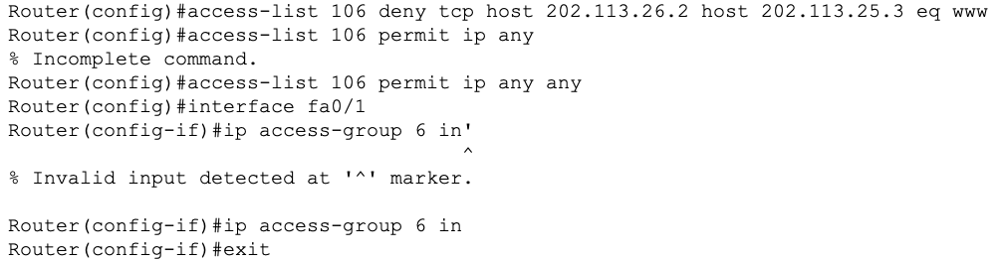

绑定成功后，先确保server网络服务已经打开

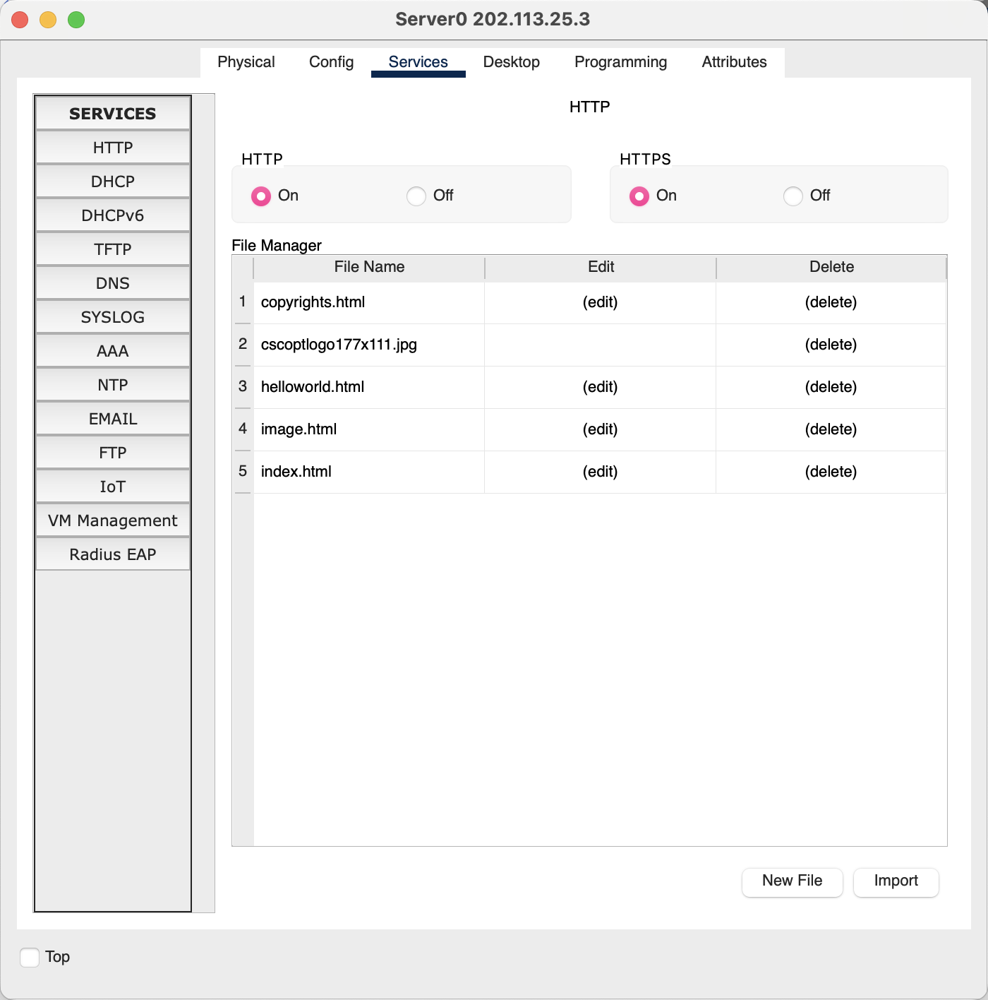

分别用PC2（202.113.26.2），PC3（202.113.26.3），PC4（202.113.27.2）访问http://202.113.25.3，得到截图如下：

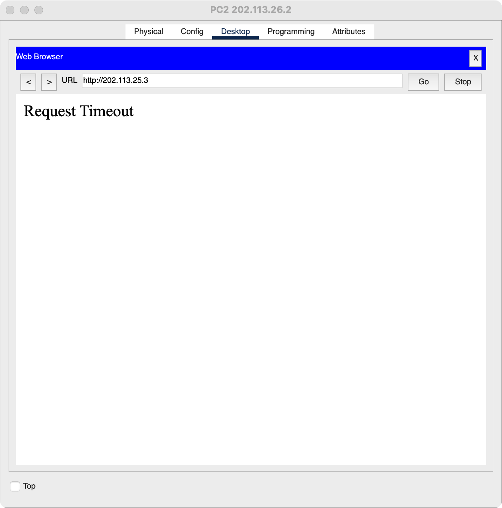

PC2无法访问webserver，被Router0阻挡。

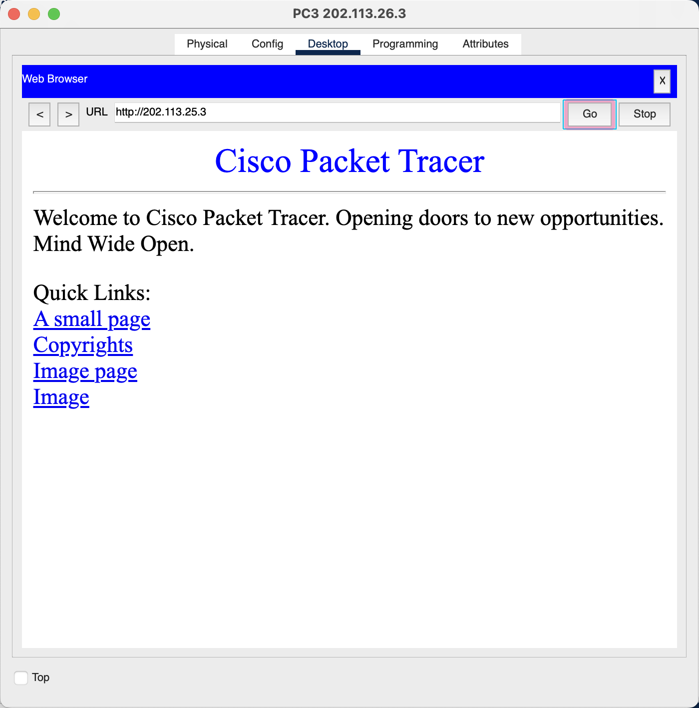

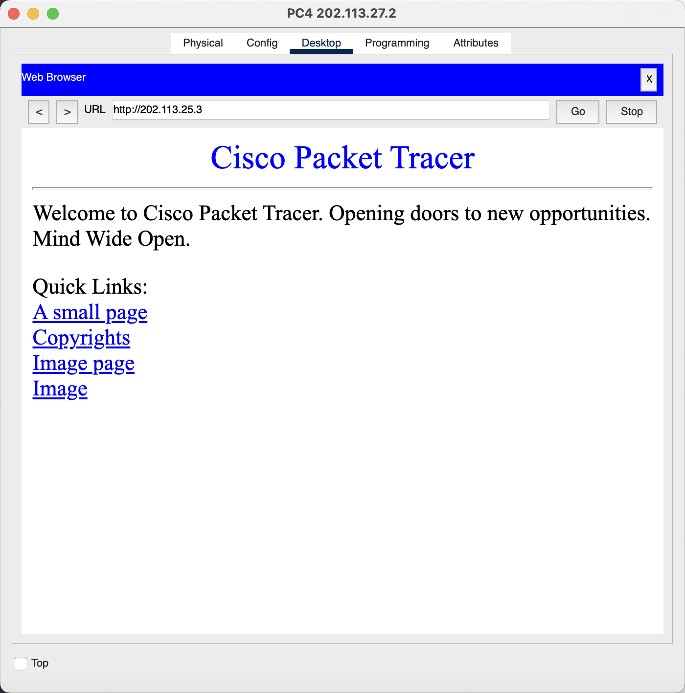


#### （4）将防火墙配置为允许内网用户自由地向外网发起TCP连接，同时可以接收外网发回的TCP应答数据包。但是，不允许外网的用户主动向内网发起TCP连接

```c
enable
config terminal
access-list 101 deny tcp any host 202.113.25.3  //创建一个序号为101的访问控制列表 抛弃所有主机向主机202.113.25.3:80发起的tcp数据报
access-list 101 permit ip any  //允许任何数据报通过，优先级低于上一条
interface fa0/1
ip access-group 101 in  //为端口Fa0/1的入站绑定ACL101
```

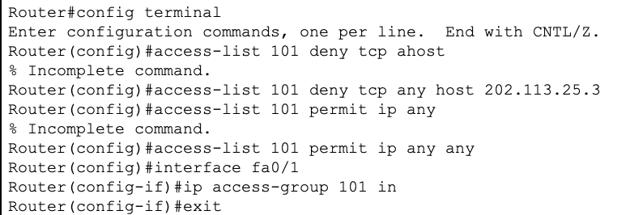


由于**HTTP协议建立在TCP协议上层**，可以通过浏览器访问来检测TCP连接。

在`202.113.26.0`子网内添加一台新的webserver `202.113.26.4`，从子网`202.113.25.0`的主机PC0（`202.113.25.2`）去访问`202.113.26.4`，可以访问，说明内网用户自由地向外网发起TCP连接，同时可以接收外网发回的TCP应答数据包。

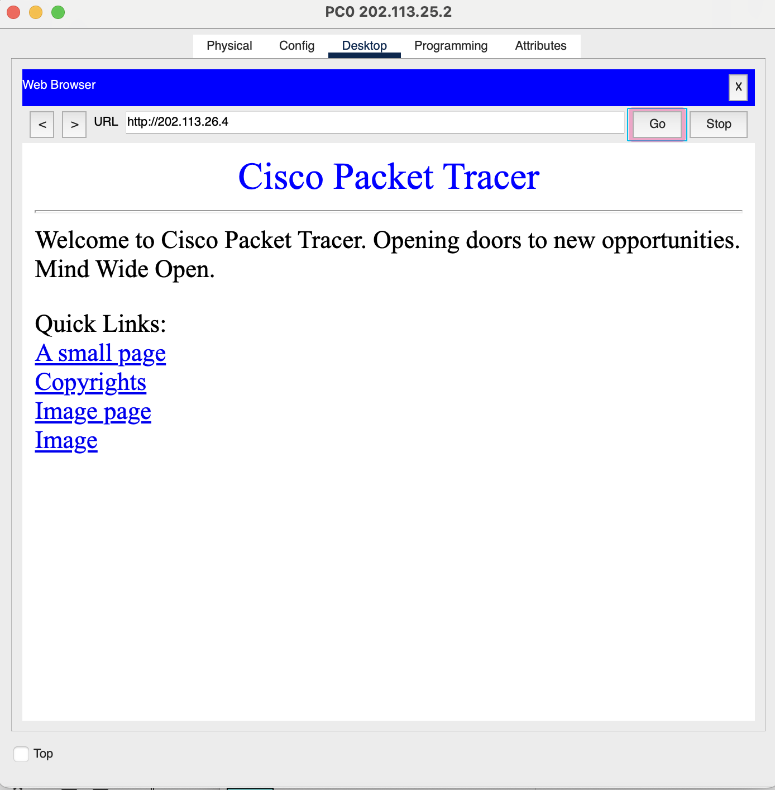

但是从`202.113.26.0`子网中的PC2（`202.113.26.2`）去访问`202.113.25.3`超时，也就是外网的用户不能主动向内网发起TCP连接。

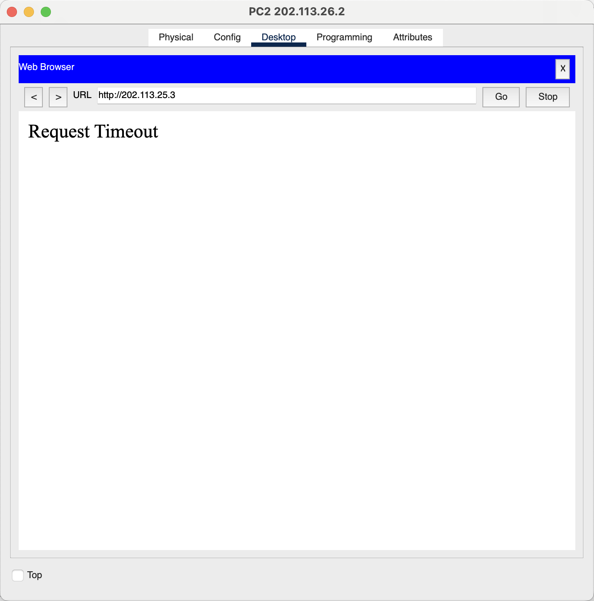


### 四、其他补充

##### **第一次配置好路由器，使用ping命令进行跨路由转发时，第一个ICMP包总是会超时**

经过在网上查阅资料可知，初次配置好的路由器没有合适的ARP映射，因此在转发到下一跳时会**尝试发送ARP请求**，并丢弃当前的包（ARP导致ICMP请求超时）。

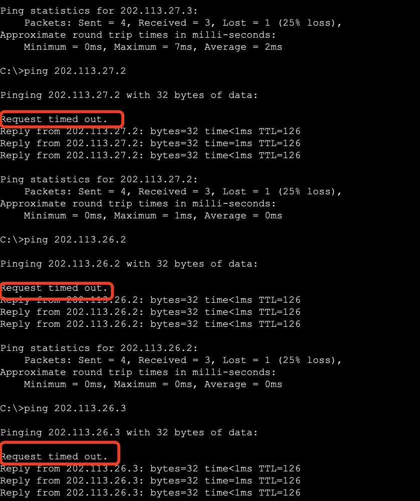

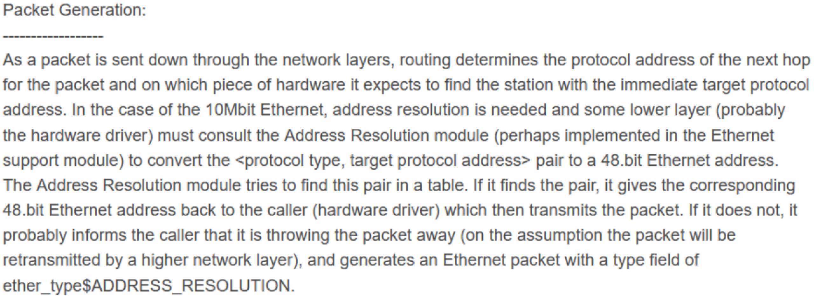