<h2><center>lab8：PPPoE服务器的配置和应用</center></h2>

<h5><center>2112614 刘心源</center></h5>

[TOC]

### 一、实验内容

#### PPPoE服务器配置和应用实验

PPPoE服务器配置和应用实验在虚拟仿真环境下完成，要求如下：

1）仿真有线局域网接入互联网的场景，正确配置PPPoE服务器的认证协议、地址池、虚拟模板和物理接口，使内网用户经认证后才能正常访问外部互联网

2）仿真家庭网络中，无线和有线终端（主机、智能电话等）连入小型路由器，由小型路由器统一接入互联网服务运营商PPPoE服务器的场景。对小型路由器和PPPoE服务器进行设置，使家庭网络中的用户经认证后才能正常访问外部互联网。


### 二、实验原理

#### PPPoE协议原理

PPPoE是以太网上的点对点协议，即Point-to-Point Protocol Over Ethernet，是一个允许在以太网广播域中的两个以太网接口间创建点对点隧道的协议。这使得它成为DSL（数字用户线）和一些光纤宽带连接常用的协议。其主要作用是：

1. **身份验证**：PPPoE提供了一种通过用户名和密码验证用户身份的机制，这对于ISP（互联网服务提供商）来说非常重要，因为它允许他们控制对网络的访问。
2. **会话控制**：它允许多个网络协议（如IP、IPX或AppleTalk）在同一物理链接上运行，并且可以建立、管理和终止点对点连接。
3. **封装**：PPPoE封装PPP帧，以便它们可以通过以太网传输。这一点对于使用基于以太网的家庭或小型办公网络的用户尤其重要。

PPPoE通常在用户的电脑或路由器上配置，并且需要与ISP的设备协同工作。**这种协议对于那些需要通过电话线（如DSL服务）或其他基于以太网的网络连接上网的用户来说是非常重要的。**

本次实验使用的是PPPoE-CHAP，其主要工作流程是：

1. **发现阶段**

   - **PADI** （PPPoE Active Discovery Initiation)

     由客户端发送的广播包，目的地址为以太网的广播地址`0xffffffffffff `，CODE （代码）字段值为`0×09`（ PADI Code ）， SESSION-ID （会话ID）字段值为`0x0000` 。**PADI 分组必须至少包含一个服务名称类型的标签（Service Name Tag ，字段值为0x0101 ），向接入集中器提出所要求提供的服务。**

     类似于**客户端呼叫**。主机在广播一个求助信号，告诉周围的网络设备你想连接到互联网。你发出的这个信号包含你需要的服务类型。

   - **PADO** （PPPoE Active Discovery Offer）

     接入集中器收到在服务范围内的PADI包之后，如果有可用的连接资源，会回应一个PADO包。其CODE 字段值为`0×07`（PADO Code ），SESSION-ID 字段值仍为`0x0000` 。**PADO分组必须包含一个接入集中器名称类型的标签（Access Concentrator Name Tag ，字段值为0x0102），以及一个或多个服务名称类型标签，表明可向主机提供的服务种类。**

     类似网络中的一个设备（比如你的互联网服务提供商的设备，叫做接入集中器）听到你的呼叫，并回应你，告诉你它可以提供什么服务。

   - **PADR**

     主机**在可能收到的多个PADO 分组中选择一个合适的PADO 分组**， 然后向所选择的接入集中器发送PPPoE 有效发现请求分组。其中CODE 字段为`0x19`（PADR Code ），SESSION_ID字段值仍为`0x0000 `。PADR 分组必须包含一个服务名称类型标签，确定向接入集线器（或交换机）请求的服务种类。

     也就是收到了来自不同服务提供商的多个回应，需要选择一个。所以，主机发出另一个信号，指定选择的服务提供商。

   - **PADS**

     接入集中器收到PADR 分组后准备开始PPP 会话，它发送一个PPPoE 有效发现会话确认PADS 分组。其中CODE 字段值为`0×65` （PADS Code）， SESSION-ID 字段值为接入集中器所产生的一个惟一的PPPoE 会话标识号码。PADS 分组也必须包含一个接入集中器名称类型的标签以确认向主机提供的服务。当主机收到PADS 分组确认后，双方就进入PPP会话阶段。

     服务提供商确认选择后，会给一个特定的会话编号，这就像是你们之间的一个私有连接代码。

 

2. **会话阶段**

   - **LCP 协商阶段** (设定通话规则)

     LCP 的Request 主机和AC 都要给对方发送，LCP 协商阶段完成最大传输单元`MTU`（也就是通话的最大时间），是否进行认证和采用何种认证方式`Authentication Type`的协商（是否需要密码认证）。协商双方互相发送一个`LCP Config-Request `报文，确认收到的`Config-Request `报文中的协商选项，根据这些选项的支持与接受情况，做出适当的回应。若两端都回应了`Config-ACK`，则标志LCP 链路建立成功， 否则会继续发送`Request`报文，直到对端回应了ACK 报文为止。

   - **认证阶段** （确认身份）

     会话双方通过`LCP`协商好的认证方法进行认证，如果认证通过了，才可以进行下面的网络层的协商。认证过程在链路协商结束后就进行。如果上一步同意使用密码，则现在需要输入密码。

   - **NCP 协商阶段**（设置网络服务）

     NCP 流程与LCP 流程类似，用户与ME 设备之间互相发送`NCP Config-Request`报文并且互相回应`NCP Config-Ack` 报文后，标志NCP 己协商完，用户上线成功，可以正常访问网络。

     在这个阶段确定了具体的网络服务设置，比如IP地址等。这就像是确定打电话的具体目的。

   - **会话维持 ** (保持连接）

     设备主动发送`Echo Request`进行`PPPoE`心跳保活，若3 次未得到服务器的响应，则设备主动释放地址。发`LCP Echo Request`的时候，魔术字字段要和之前通信的`Configure_Request`使用的魔术字字段保持一致。有些设备或终端不支持主动发送`Echo-Request`报文, 只能支持回应`Echo-Reply`报文。

   - **会话结束**

     `PPPoE` 还有一个`PADT` 分组，它可以在会话建立后的任何时候发送，来终止PPPoE 会话，也就是会话释放。它可以由主机或者接入集中器发送，**目的地址填充为对端的以太网的MAC 地址**。当对方接收到一个PADT分组，就不再允许使用这个会话来发送PPP业务。PADT 分组不需要任何标签， 其CODE 字段值为`0xa7`，SESSION-ID 字段值为需要终止的PPP 会话的会话标识号码。在发送或接收PADT后，即使正常的PPP 终止分组也不必发送。PPP 对端应该使用PPP 协议自身来终止PPPoE会话，但是当PPP 不能使用时，可以使用PADT。


### 三、实验验证

#### （1）搭建实验所需组网，配置各设备端口IP

各设备的ip配置方法在之前的实验中已经提到，这里略，注意配置好各设备的默认网关.

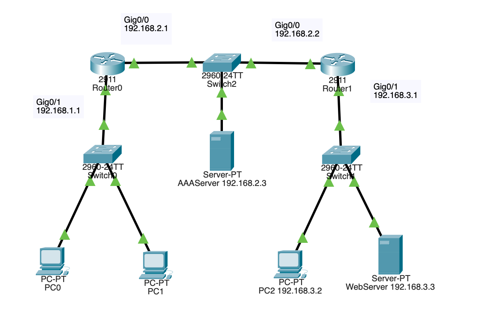

使用ping命令检查一下网络连通性，可以连通

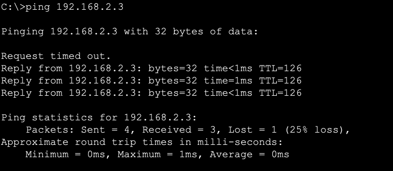


#### （2）配置路由器

使用以下指令：

```c
aaa new-model 
//在Router0中启用路由器的认证、授权和计费功能
aaa authentication ppp myPPPoE group radius 
//创建一个标号为myPPPoE的ppp认证方式，采用radius协议
radius-server host 192.168.2.3 auth-port 1645 key radius123  //将主机192.168.2.3作为aaa服务器，使用1645端口，访问密码为radius123
```

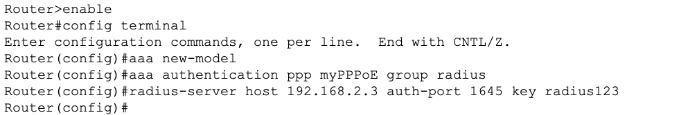


#### （3）配置账号密码

在主机192.168.2.3内打开AAA服务，要求端口号和刚才设置的端口相同，并设置客户端和接入用户的账号和密码。

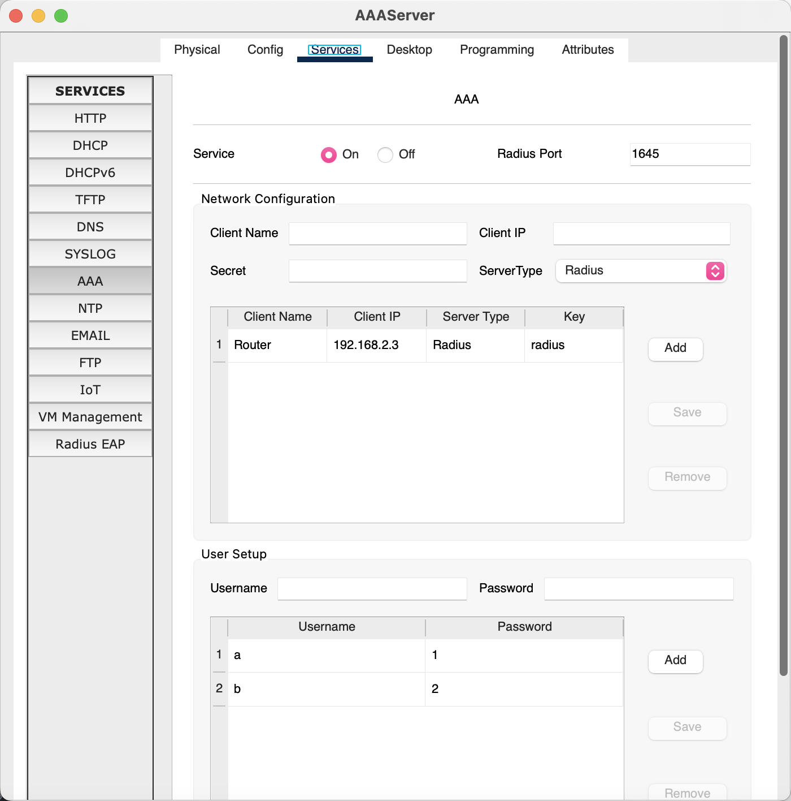


#### （4）配置路由器地址池

打开路由器，配置本地地址池，在CLI界面中使用以下指令：

```c
Ip local pool myPool 192.168.1.100 192.168.1.200  //配置一个叫做myPool的IP池，路由器将为接入用户从池中分配一个IP
```


#### （5）配置路由器虚拟接口模板

在上一步的基础上，使用以下指令：

```c
Interface virtual-template 1  //创建一个编号为1的虚拟接口模板
Ip unnumber Fa0/1  //告知虚拟模板 此虚拟接口没有分配IP地址 若需要则直接使用Fa0/1的IP地址
Peer default ip address pool myPool  //将此虚拟接口和地址池myPool绑定
Ppp authentication chap myPPPoE	  //告知虚拟接口的ppp验证模式是刚定义的myPPPoE模式 并且启用CHAP认证
```

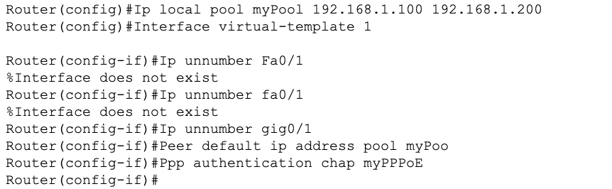


#### （6）创建BBA组

在步骤五的基础上，使用以下指令：

```c
Bba-group pppoe myBBAGroup  //创建一个名叫myBBAGroup 的bba组
Virtual-templa 1  //指定BBA组所用的虚拟接口模板
```

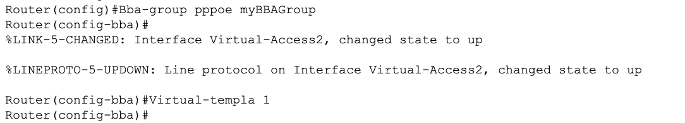


#### （7）配置物理接口

在步骤六的基础上，使用以下指令：

```c
Interface Fa0/1  //在接口Fa0/1上配置
Pppoe enable group myBBAGroup  //在Fa0/1上启用pppoe功能，使用BBA组myBBAGroup 
```


#### （8）验证配置结果

打开PC1，在应用中找到PPPoE Dialer，使用账号bob进行登录，登陆成功。

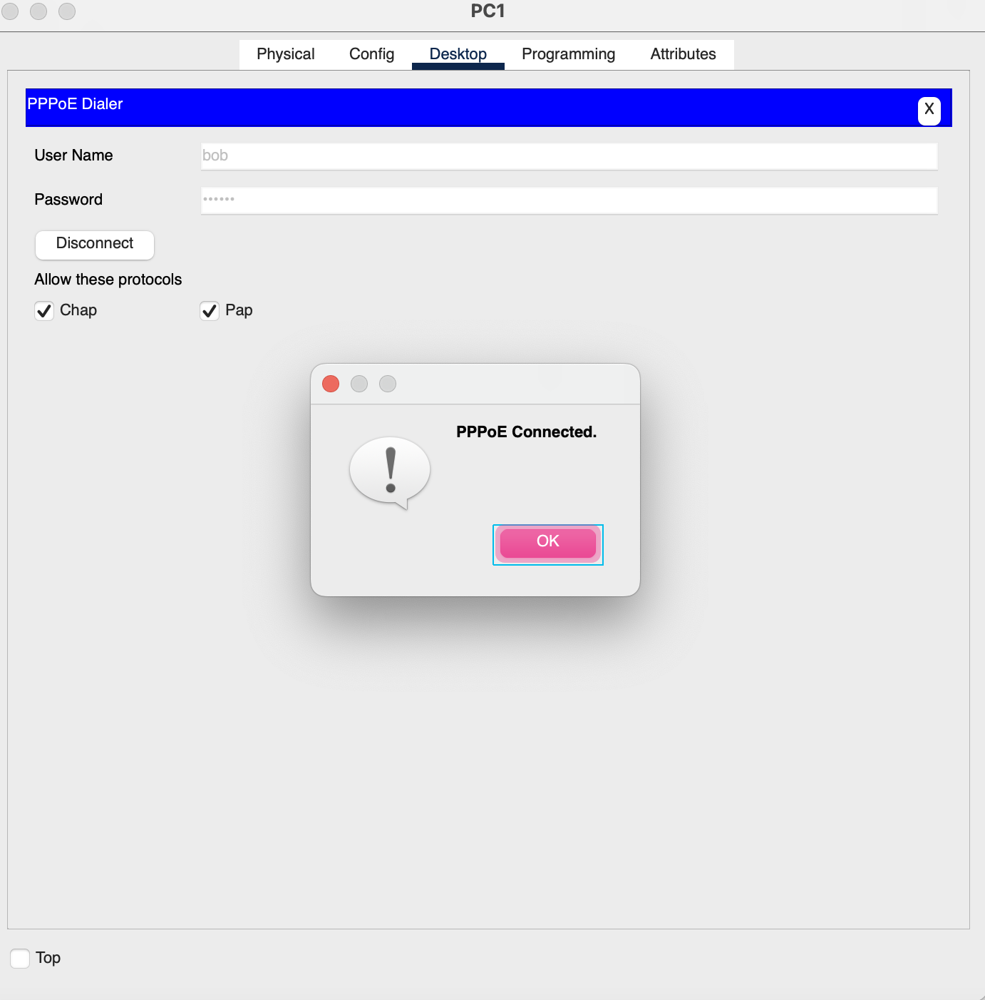

使用PC1去ping外网主机192.168.3.2，发现可以和外网联通。

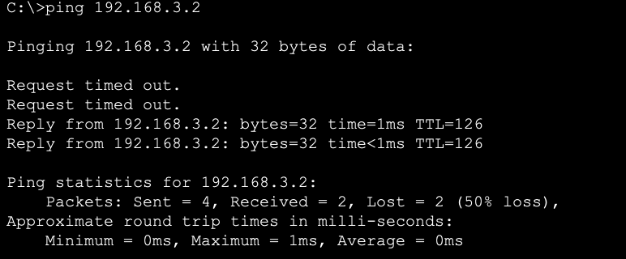

在PC1使用指令`ipconfig`可以看到PC1分配到的IP

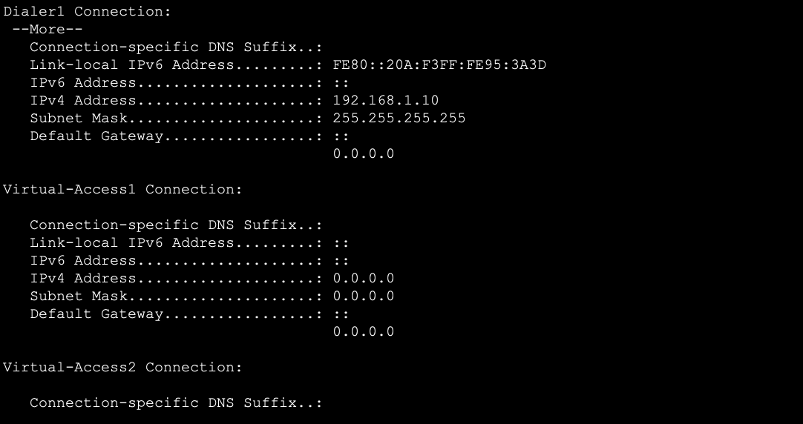


#### （9） 仿真家庭网络

配置家庭网络如下：

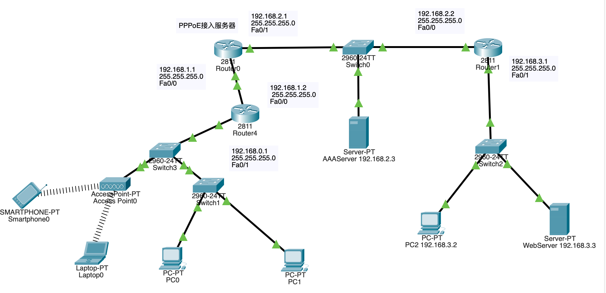

1. **进入全局配置模式**：
   ```
   Router> enable
   Router# configure terminal
   ```

2. **创建并进入虚拟模板接口**：
   这个虚拟模板定义了PPPoE客户端的参数，可以被应用到一个或多个物理或逻辑接口上。
   ```
   Router(config)# interface dialer 1
   ```

3. **设置IP地址获取方式为自动**：
   PPPoE连接通常使用自动获取IP地址。
   ```
   Router(config-if)# ip address negotiated
   ```

4. **设置封装类型为PPPoE**：
   ```
   Router(config-if)# encapsulation ppp
   ```

5. **启用PPP拨号并绑定物理接口**：
   
   ```
   Router(config-if)# dialer pool 1
   Router(config-if)# exit
   Router(config)# interface Fa0/0
   Router(config-if)# pppoe enable group global
   Router(config-if)# pppoe-client dial-pool-number 1
   ```

6. **配置PPP认证**：
   根据ISP的要求，可能需要设置PAP/CHAP认证。你需要使用从ISP那里获得的用户名和密码。
   ```
   Router(config)# interface dialer 1
   Router(config-if)# ppp authentication chap callin
   Router(config-if)# ppp chap hostname bob
   Router(config-if)# ppp chap password bob123
   ```

7. **设置路由器的默认路由**：
   ```
   Router(config-if)# ip route 0.0.0.0 0.0.0.0 dialer 1
   ```

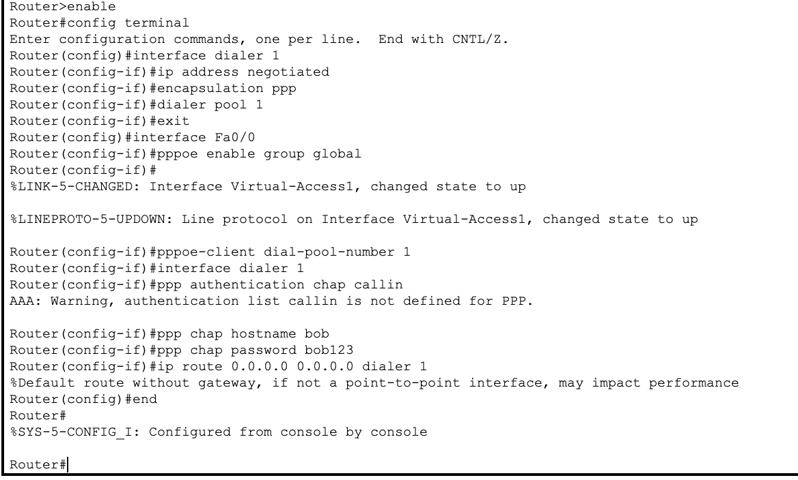

输入用户名和密码发现设备可以连接成功QAQ

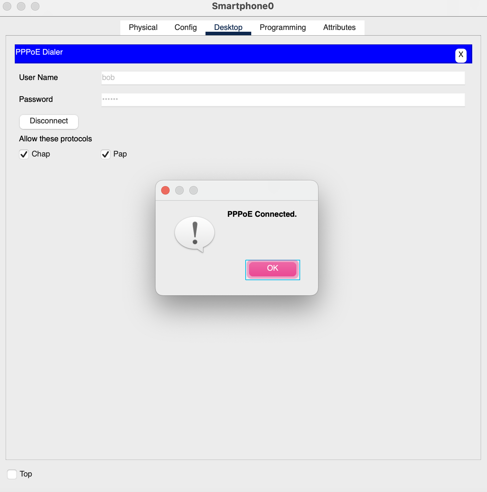

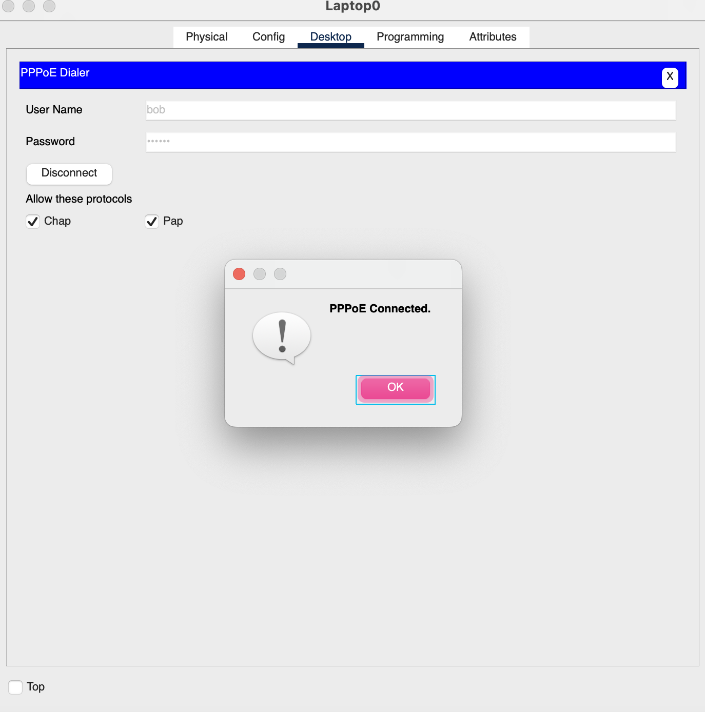

使用`ping`之后可以得到外网的回复：

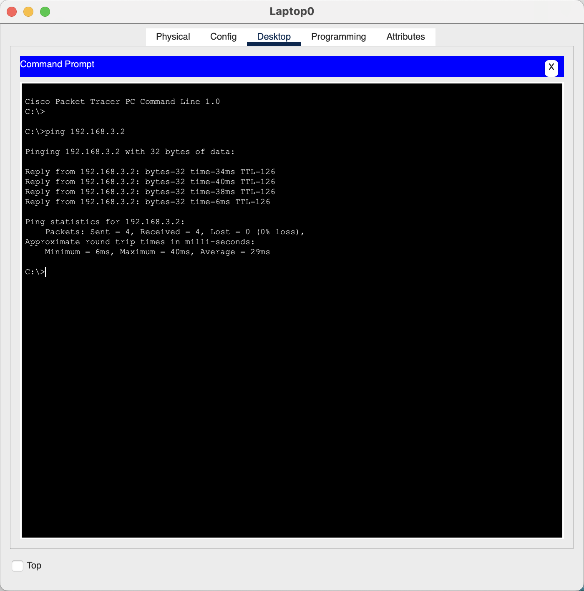

查看`laptop`的IP地址如下：

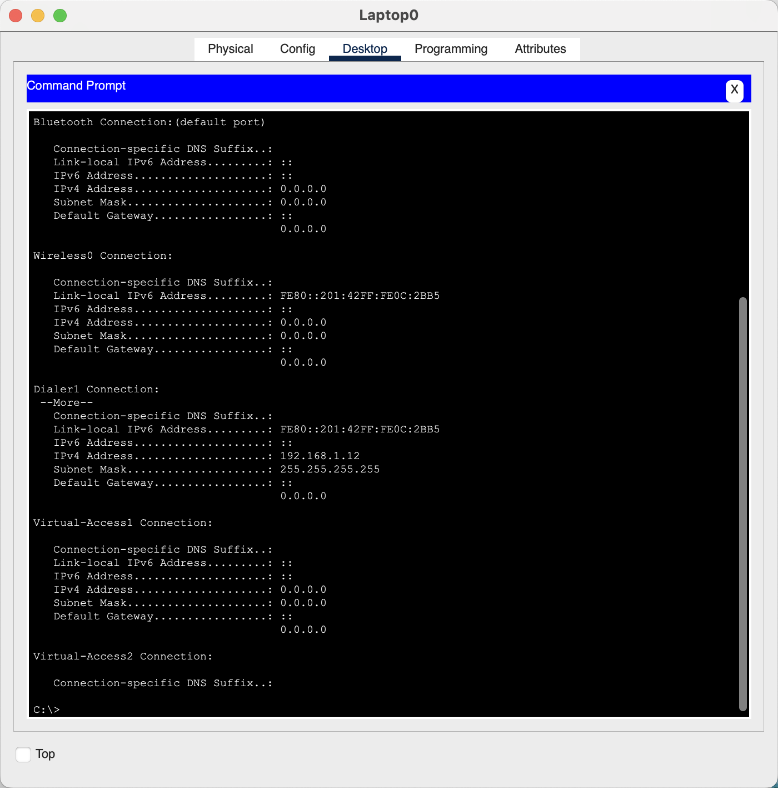


### 四、其他补充

#### PPPoe协议补充

PPPoE（Point-to-Point Protocol over Ethernet）是一种网络协议，主要操作在OSI模型的链路层（第二层）。PPPoE实际上结合了两个不同的协议：PPP（Point-to-Point Protocol）和以太网（Ethernet）。

1. **PPP（Point-to-Point Protocol）**
   - PPP本身是一个链路层协议，用于在两个网络实体之间建立直接的连接。它主要用于序列化的连接（如拨号连接），提供如身份验证、压缩和多协议封装等功能。

2. **以太网（Ethernet）**
   - 以太网是一种链路层技术，用于在局域网（LAN）中传输数据。它定义了数据包的物理和数据链路层传输。

3. **PPPoE的角色**
   - PPPoE将PPP的功能结合到以太网框架中，允许通过以太网（通常是广泛使用的LAN技术）传输PPP数据包。这意味着，PPPoE使得可以在以太网基础上实现PPP的点对点连接功能，如宽带互联网接入（例如通过DSL）。

因此，当我们讨论PPPoE作为点对点协议时，我们是指它在链路层（OSI模型的第二层）上实现PPP的功能，同时利用以太网的物理和链路层技术。PPPoE是点对点连接和以太网技术的结合体，允许在更广泛的网络环境中使用PPP协议的特性。

1. **点对点（Point-to-Point）的含义**：在网络术语中，点对点通常指的是两个网络节点之间的直接连接。这种连接方式使得两个节点可以直接通信，无需通过任何其他中介或网络设备。点对点连接是一对一的，与多对多的网络拓扑相对。
2. **PPPoE 的作用**：PPPoE 允许单个客户端设备通过以太网桥接到远程服务器上，并在这种连接上运行PPP。通常，这用于通过宽带连接（如DSL）访问互联网，其中客户端设备通过本地网络连接到远端的互联网服务提供商（ISP）。


#### 点到点（Point-to-Point）

点到点指的是**在两个网络节点之间的直接连接**。在这种情况下，一个节点直接与另一个节点通信，**没有任何中间设备或只有很少的中间设备**（比如一个交换机或路由器）参与传输。这种通信通常是单一的连接，不涉及网络中的其他节点。点到点连接可以是物理的，如通过以太网电缆连接的两台计算机，也可以是逻辑的，如通过互联网的VPN连接。

点到点连接的特点：
- **专用性**：通常用于特定的两个设备之间，不被其他设备共享。
- **简单性**：通常比较简单，因为只涉及两端的配置和管理。
- **直接性**：数据从一个点直接发送到另一个点，中间不经过其他节点。

#### 端到端（End-to-End）

端到端则是一个更广泛的概念，指的**是数据在源节点和目的节点之间的整个通信过程，这些节点可以是网络中的任何两个端点**。端到端可以涉及多个中间网络设备（如路由器和交换机）和多个网络。端到端的一个重要原则是，通信应该尽可能地在源和目的地之间直接进行，中间的网络设备应该对数据传输尽可能地透明。

端到端的特点：
- **通用性**：端到端连接可以在多个不同设备之间进行，并且支持复杂的网络拓扑。
- **复杂性**：涉及多个网络设备和多个网络层次，因此通常比点到点更复杂。
- **自治性**：在端到端的原则下，通信的两个端点应该独立于中间网络处理自己的数据和错误。

##### 两者的区别

1. **连接范围**：
   - **点到点**：连接范围局限于两个网络节点之间的直接连接。这意味着只有两个设备参与交流，它们之间的连接可以是物理直连，也可以是逻辑直连。
   - **端到端**：连接范围涵盖从源节点到目的节点间的整个通信路径。这通常涉及多个网络和传输段，数据在到达最终目的地之前可能会通过多个中转节点。

2. **用途和应用**：
   - **点到点**：通常用于单一的、专用连接，如连接两台计算机或其他设备，或者在拨号上网、VPN连接中。
   - **端到端**：涵盖更广泛的应用，如整个互联网通信，它允许数据跨越多个中间设备和网络边界。

3. **设计原则**：
   - **点到点**：设计上比较简单，因为它只涉及两个节点的连接。通信协议可以优化为这两点间直接的数据传输。
   - **端到端**：设计必须考虑整个通信路径上的复杂性。端到端原则认为，应用层应当在可能的情况下维持通信的完整性和可靠性，而不仅仅依赖于单个链路的可靠性。

4. **数据传输的透明性**：
   - **点到点**：数据传输相对直观，数据包从一个端点发送到另一个端点，通常不需要复杂的路由决策。
   - **端到端**：数据传输可能需要经过复杂的网络设备和路由选择，因此端到端的通信协议需要能够处理复杂的网络拓扑和潜在的传输问题。

总的来说，点到点连接关注的是两个具体节点之间的直接联系，而端到端连接考虑的是在源节点和目的节点之间的整个数据传输过程。在实际的网络设计和操作中，这两种概念经常同时出现，比如在建立一个端到端的通信会话时，会涉及到多个点到点的连接。